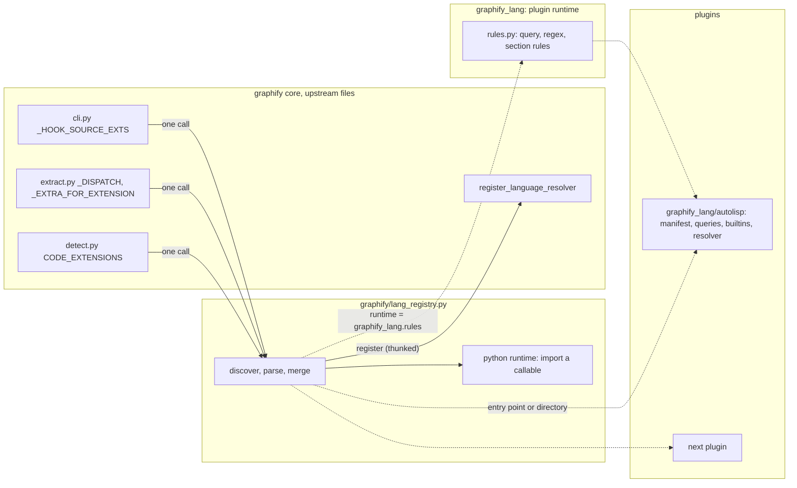

# Software Requirements Summary

<!-- TEMPLATE ZONE START — Do not edit between TEMPLATE markers -->

| Field | Value |
|-------|-------|
| ID | RS000.001 |
| Date | 2026-09-08 |
| Status | Refining |
| Repository | `~/repos/graphify-lang` (fork of `Graphify-Labs/graphify`, branch `v8`) |
| Author | main (research by ag-search ×3); reviewed by ag-reqs, ag-review, ag-test, ag-devops, ag-writer; adjudicated by ag-build |
| Version | v2 |
| Pipeline-Next | ag-build Plan mode → `.claude/docs/cc-IP000.001.md`. Adjudication log: `.claude/docs/cc-RS000.001.squad-check.md` |

---

## §1 Problem Definition

### §1.1 Problem Statement

graphify turns a folder of code and documents into a queryable knowledge
graph so that an agent answers structure questions from a scoped subgraph
instead of reading raw files. The graph is only as good as the extractor for
each language, and adding or fixing a language today means editing **six
tables across five files** inside a 7,700-line core that upstream changes 19
times a month (`cc-RF010.002.md` §2, §4).

The six tables, named here once and referred to by this phrase everywhere
below:

| # | Table | File |
|--:|:------|:-----|
| 1 | `_DISPATCH` | `graphify/extract.py:5630` |
| 2 | `_EXTRA_FOR_EXTENSION` | `graphify/extract.py:5740` |
| 3 | `CODE_EXTENSIONS` | `graphify/detect.py:44` |
| 4 | `_WATCHED_EXTENSIONS` (a one-time union of #3 at import) | `graphify/watch.py:278` |
| 5 | `_HOOK_SOURCE_EXTS` (a **tuple**, not a set) | `graphify/cli.py:71` |
| 6 | the resolver registry `_REGISTRY` | `graphify/resolver_registry.py:48` |

Line numbers throughout this document are the fork checkout's, i.e.
`v0.9.55` (`pyproject.toml:7`); `cc-RF010.002.md` §2.1 carries the +59/+60
offsets for `extract.py` at 0.9.56.

The concrete failure that started this fork: on the AutoLITHP repository
(`~/repos/autolithp`) graphify 0.9.55 produces one node and zero edges per
AutoLISP file, so the graph describes the repository's Python tooling and
not its product. The god nodes are Python helpers; the 2,980 `defun` forms,
the 49 `C:` commands, the module headers, and the 8 DCL (Dialog Control
Language) dialogs are invisible (`README.md`, 'The problem'; `ltm.db`
learning id 1212 — '#' is reserved throughout this document for GitHub
issue and PR numbers, and issue #1212 is a different thing entirely).

Measured 2026-09-08 over the pinned corpus of §1.3: 2,980 `(defun`/`(defun-q`
forms, 49 `(defun C:` forms, 3 `.dcl` files carrying 8 `name : dialog {`
declarations. The '18' that earlier drafts and `cc-RF010.003.md` §3.1 carried
is the count of `new_dialog` **call sites** in the `.lsp` files, not of
dialogs or of `.dcl` files.

This project adds a language-extension layer to graphify so that:

1. A language is described by a plugin package that the core discovers but
   never imports by name, with a small, stable core diff that survives
   rebases.
1. A plugin is primarily a declarative definition file (TOML), with a Python
   escape hatch, so that programming languages, markup, configuration
   formats, and eventually rule-defined prose 'languages' (standards,
   legislation, manuals, specifications) can all be described with the same
   mechanism.
1. AutoLISP, DCL, and MNL (Menu AutoLISP) are the first plugin, measured
   against AutoLITHP.

The goal behind the feature is the productivity gain the graph exists for:
fewer tokens spent locating information in a codebase, for any language a
plugin covers.

### §1.2 Target Users

| User | Skill level | Uses the project to |
|:-----|:------------|:--------------------|
| The fork owner (this user) | Expert AutoLISP, Python, PowerShell; runs Claude Code and OMP against the same repositories | Get a real graph of AutoLITHP and other AutoLISP repositories; cut token spend on code search |
| Coding agents (Claude Code, OMP) | Consume `graphify query`, the `graphify` MCP server, and the read-nudge hook | Answer structure questions from the graph; be nudged on `.lsp` and `.dcl` reads |
| Plugin authors (later: the user for prose languages; possibly upstream contributors) | Comfortable with TOML and regex; may or may not know tree-sitter or Python | Define a language without touching graphify's core |
| Upstream maintainer | Owns `Graphify-Labs/graphify` | Evaluate a registry proposal offered as an issue with a reference implementation |

### §1.3 Success Criteria

Every criterion names its instrument and carries a **tier**. A *release
gate* blocks the phase that produces it. A *recorded measurement* is taken
once, written into the implementation plan, and never re-gated — it exists
to prove the project did what it set out to do, not to fail a build
(RQ-12). The priority column in §4.1 follows this split: a feature that
serves only recorded measurements is at most Should Have.

**The corpus, pinned.** 'Corpus' means the AutoLITHP repository
(`~/repos/autolithp`) at commit **`f7ab804`**, restricted to the four
directories `src/`, `tests/`, `Import-Refactor/` and `build/`. Measured on
this host 2026-09-08 at that commit, clean tree:

| Quantity | Value | Instrument |
|:---------|------:|:-----------|
| `.lsp` files | 80 | `find src tests Import-Refactor build -name '*.lsp' \| wc -l` |
| `(defun` / `(defun-q` forms | 2,980 | the same set through `grep -Eio '\(\s*defun(-q)?\s'` |
| `(defun C:` forms | 49 | the same set through `grep -Eio '\(\s*defun\s+c:'` |
| `.dcl` files | 3 | `src/ui/manager.dcl`, `Import-Refactor/Archive/dialogs/{cbc,dtk}_app_dialogs.dcl` |
| `name : dialog {` declarations | 8 | 1 + 2 + 5 across those three files |
| total `.lsp` bytes | 2.24 MB | `find … -printf '%s\n'`, summed |

Two requirements follow, and both fall on the fork, never on AutoLITHP
(RQ-2):

1. **No criterion may write to `~/repos/autolithp`.** The earlier plan to
   append `.claude/worktrees/` to that repository's `.graphifyignore` is
   withdrawn: at `f7ab804` the repository has **no `.graphifyignore` at
   all** (measured), so the step would create a file in a tree this project
   does not own, and it cannot be performed at all on the Windows host of
   §2.1. The directory restriction is expressed fork-side instead, as an
   explicit file list checked into the fork (F18) and passed as
   `extract(paths, root=…)`.
2. **The checked-in file list is the oracle, not a dated constant.**
   `.claude/worktrees/` held 444 agent-worktree clones when this SRS was
   first drafted and holds none today, so the same `**/*.lsp` glob returns
   480 files or 80 depending on the day. Only the pinned commit plus the
   checked-in list makes SC5 reproducible.

**SC1's oracle must exist before SC1 can be asserted.** Measured
2026-09-08: `~/.venvs` does not exist, and neither the system interpreter
nor the pipx venv `~/.local/share/pipx/venvs/graphifyy` has pytest
(`import pytest` → `ModuleNotFoundError` on both), so `pytest tests/ -q`
has **never been run in this fork**. `pyproject.toml:13-46` also gates much
of the suite behind ~30 tree-sitter distributions plus the `commonlisp` and
`mcp` extras, so the pass set depends on exactly what Workflow 1 installs.
The implementation plan's first task is therefore: create the venv per
Workflow 1, run the suite on **unmodified `v8`**, and check in the resulting
pass/fail/skip counts and the resolved dependency set as SC1's baseline.
Without it a pre-existing failure, or a skip caused by a missing extra, is
charged to the registry (TS-1).

| ID | Criterion | Tier | Instrument |
|----|-----------|------|------------|
| SC1 | `pytest tests/ -q` exits 0 on the fork with no upstream test file edited, both with the plugin discoverable and with `GRAPHIFY_LANG_DISABLE=1`, and the pass/fail/skip counts equal the checked-in `v8` baseline | Release gate | `pytest tests/ -q` in the Workflow 1 venv; `-m 'not perf'` is the default via `addopts` (TS-11) |
| SC2 | With no plugin discoverable, **all six tables of §1.1** are byte-identical to upstream: `_DISPATCH` keys and values-by-`__name__`, `_EXTRA_FOR_EXTENSION`, `CODE_EXTENSIONS`, `watch._WATCHED_EXTENSIONS`, `cli._HOOK_SOURCE_EXTS`, and `resolver_registry.registered_resolvers()` (which must contain no plugin resolver) | Release gate | `subprocess.run([sys.executable, "-c", …])` with `GRAPHIFY_LANG_DISABLE=1` and no manifest on any discovery path, serialising the six tables for comparison against a snapshot regenerated from `upstream/v8` at each rebase (RQ-4, TS-2). It **cannot** be an in-process assertion: F4's merges are irreversible in-process — `CODE_EXTENSIONS.update()` mutates the object `watch.py:279` aliases, `_HOOK_SOURCE_EXTS += …` rebinds a module global, and `_WATCHED_EXTENSIONS` is a one-time union snapshot |
| SC3 | A stub plugin on `GRAPHIFY_LANG_PATH` is dispatched for its suffix through `_get_extractor`, listed by `collect_files`, classified `CODE` by `detect.classify_file`, and matched by the hook's suffix test | Release gate | `tests/test_lang_registry.py`, one subprocess per direction (see SC2) |
| SC4 | Function nodes from `src/core/err.lsp` = **27**, each with a distinct id; `C:LITHP`, `C:LITHP-MGR`, `C:LITHP-INIT` from `src/core/ldr.lsp:526-541` appear as `command` nodes; `err:trap` is one node whose label keeps its first-seen spelling | Release gate | `extract([…], root=…)`; requires the §3.2 collision-disambiguation recipe — see the note below |
| SC5 | `count(nodes where node_kind in {function, command})` over the corpus is within 2% of the `(defun`/`(defun-q` count over **the checked-in file list**, both computed in the same test run | Release gate | the file list checked in under `tests/lang/`; the grep is `grep -Eio '\(\s*defun(-q)?\s'` over exactly those paths. The 2,980 above is today's value of that expression, not a constant the test hard-codes (RQ-5) |
| SC6 | `err:trap` has at least one inbound `calls` edge from another file; at least one `dcl_references` edge into `lithp_mgr` from `src/ui/manager.dcl` | Release gate | `extract(…)` over the corpus, post-resolution |
| SC7 | `graphify` god nodes on the corpus are AutoLISP symbols, not Python helpers (top 10 by degree, `analyze.god_nodes`) | Release gate | `analyze.god_nodes` on the built graph |
| SC8 | Token reduction over the §4.2 question set, measured once and recorded with its raw figures | Recorded measurement | A **fork-owned script** calling `benchmark.run_benchmark(questions=…)` directly, plus a procedurally-defined grep-then-read baseline (the exact grep per question, whole-file reads, `len(text)//4` tokens). The CLI cannot produce this: `cli.py:3088-3103` never passes `questions`, and `benchmark.py:85` compares against an estimate of the **whole corpus** (`corpus_words`, falling back to `nodes * 50`), not against the files a grep-then-read answer touches (RQ-6). No threshold gates release |
| SC9 | Extraction of the corpus completes in under 5 s on this host | Recorded measurement | `@pytest.mark.perf`, deselected from SC1 (TS-11); assert a generous absolute ceiling and record the raw figure. Parse alone is 0.5 s for 80 files with either candidate grammar |
| SC10 | The AutoLISP plugin is defined by a TOML manifest plus one Python module; the DCL manifest is regex rules only, with no Python | Recorded measurement | file inventory of `graphify_lang/autolisp/` |
| SC11 | Three manifest templates (`programming`, `markup`, `prose`) exist and load without error | Recorded measurement | `tests/lang/test_templates.py` |
| SC12 | The read nudge fires for a `.lsp` file, **and** `'.lsp' in graphify.watch._WATCHED_EXTENSIONS` | Release gate | In-process: `_run_hook_guard('read')` (`cli.py:814-881`) takes its payload from stdin and writes to stdout, so a `tmp_path` project with `graphify-out/graph.json`, `CLAUDE_PROJECT_DIR` pointed at it, a monkeypatched `sys.stdin.buffer` carrying `{"tool_input": {"file_path": ".../err.lsp"}}` and `capsys` asserts the whole thing (TS-4). Plus **one recorded manual run** of the installed hook per Workflow 2, because the installed-hook path is blocked by the executable question in §7.1 Q7. The watch half also pins the import-order invariant SC2 depends on |
| SC13 | With a manifest carrying an unknown `schema`, and separately with a manifest whose runtime module is not importable: extraction of the corpus yields the **same node and edge counts as with no plugin**, `import graphify.cli`, `graphify.detect` and `graphify.extract` all still succeed, and exactly one warning line naming the manifest is emitted — whose text contains `not installed` or `failed to load` | Release gate | `tests/lang/test_lang_registry_failure.py`; assert the **warning text**, not only the counts (RQ-14, RV-7, TS-3) |
| SC14 | In a subprocess with the plugin discoverable, after `import graphify.extract, graphify.cli`: `not any(m.startswith("graphify_lang") for m in sys.modules)` and `"tree_sitter_commonlisp" not in sys.modules`; after dispatching one `.lsp` file, both are present | Release gate | the only assertion that catches an eager resolver, an eager grammar load, or a stray top-level import in the plugin package — each of which costs every `graphify` run in every repository, not only AutoLISP ones (TS-13) |

**The SC4 id recipe.** `27` is only reachable if the plugin disambiguates
colliding ids. `graphify.ids.normalize_id` collapses every run of non-word
characters to `_` (`graphify/ids.py:80-83`), not only case, so
`err:trap` and `err:_trap` both normalise to `err_err_trap`: measured over
`src/core/err.lsp`, 27 `defun` forms yield **26** distinct `make_id`
results. Over the whole 80-file corpus there are **11 colliding id groups**
— 5 of the `pkg:name` / `pkg:_name` privacy-convention kind
(`err:trap` in two files, `log:failure-p`, `log:failure-message`,
`pltrn:rec-fault`) and 6 where `*error*` is defined more than once in one
file (24 times in `src/plugins/pltrn.lsp`). The `pkg:_private` convention
AutoLITHP uses is exactly what the `:` → `_` rewrite erases, so merging is
a graph defect, not a cosmetic one (RV-1). **Requirement:** on collision
within a file, append the definition's line number, exactly as
`extract_markdown` already does for repeated headings
(`_make_id(stem, title, str(line_num))`). The measured collision set is
checked in as a fixture so SC4's `27` is derived from the recipe rather
than asserted as a constant.

### §1.4 Abbreviations

Expanded here once; used unexpanded thereafter.

| Term | Expansion |
|:-----|:----------|
| COM | Component Object Model (the `vla-`/`vlax-` ActiveX surface AutoLISP reaches through `vl-load-com`) |
| CUIx | Customization User Interface (compressed) — AutoCAD's menu/ribbon customisation file, a ZIP of XML |
| DCL | Dialog Control Language — AutoCAD's declarative dialog-definition language, `.dcl` |
| MNL | Menu AutoLISP — AutoLISP source loaded automatically with a same-named CUIx, `.mnl` |
| MoSCoW | Must / Should / Could / Won't prioritisation |
| NFR | Non-functional requirement (§5) |
| SC | Success criterion (§1.3) |

### §1.5 Out of Scope for v1

Named so that ag-build does not have to infer the boundary. Each is a
deliberate exclusion, not an oversight; F20 to F23 carry the ones that are
roadmap items rather than permanent exclusions.

| Excluded | Why |
|:---------|:----|
| `.cuix` / `.cui` / `.mnu` parsing, and command-macro strings (`^C^C(c:foo)`) | Three formats, one of them a ZIP of XML, for one edge; Autodesk publishes no macro grammar; the corpus has zero such files (`cc-RF010.003.md` §4) |
| VLX separate-namespace semantics (`vl-doc-export`, `vl-arx-import`, `vl-bb-set`/`-ref`) | Zero occurrences in the corpus; a visibility attribute, not a node kind (`cc-RF010.003.md` §5 row 19) |
| Any change to graphify's LLM / semantic path (`llm.py`, `serve.py`, the semantic id remap) | The plugin path is deterministic by design (§5 Reliability); the semantic path consumes whatever the extractor produced |
| Publication of the fork, or of any plugin, to PyPI | The fork does not own the `graphifyy` name; fork releases are git tags only (§5 Release row) |
| Support for AutoLISP repositories other than the pinned acceptance corpus | Nothing else is measurable; a second corpus is a follow-on project, and F23's grammar upgrade names 'a real corpus' as its trigger |
| Editing any upstream test file, extractor, `engine.py`, or `resolution.py` | Fork rule (F25) |
| A project-local `./.graphify/languages/` discovery tier | Dropped from v1 (§3.1, RV-2/RV-8/DV-1): it is CWD-anchored rather than corpus-anchored, `.gitignore:15` ignores `.graphify/` so it cannot be reviewed or reach the Windows host, and it would execute corpus-supplied Python. `GRAPHIFY_LANG_PATH` covers the checked-out-plugin case deterministically |

---

## §2 Environment

### §2.1 Target Platform(s)

| Platform | OS | Notes |
|----------|----|-------|
| Linux aarch64 (this host) | Ubuntu, kernel 6.17, Python 3.12.3 | Primary development and measurement host. `tree-sitter 0.25.2`, `tree-sitter-commonlisp 0.4.1` present in the pipx venv |
| Windows x64 | Windows 11 | Second host per `CROSS-HOST.md`; the same repositories are worked on there. Any compiled grammar needs a wheel for both |
| Python | 3.10 to 3.13 | `pyproject.toml:13` (`requires-python >= 3.10`). `tomllib` is stdlib from 3.11; `tomli` is already a dependency below 3.11 |

### §2.2 Integration Points

| System | Type | Protocol | Notes |
|--------|------|----------|-------|
| `graphify` core (`extract.py`, `detect.py`, `cli.py`, `watch.py`, `resolver_registry.py`) | In-process Python | Module-level tables mutated at import | The six tables of §1.1 |
| Language plugin packages | Python distribution | `importlib.metadata` entry point group `graphify.languages` | Installed with `pip`/`pipx inject` into whichever venv runs `graphify` |
| Manifest directories | Filesystem | `~/.graphify/languages/*/graphify-lang.toml`, then `GRAPHIFY_LANG_PATH` entries in listed order | Same shape as upstream's `~/.graphify/providers.json` (issue #1084). **The project-local `./.graphify/languages/` tier is out of scope for v1** (§1.5): it resolves against the process CWD rather than the corpus and F4 fixes the tables at import, before the CLI has parsed its target — so `graphify ~/repos/autolithp` run from elsewhere would discover nothing while `graphify .` inside it would, with no way to re-resolve (RV-2, mirroring `graphify/llm.py:228`'s literal `Path(".graphify") / "providers.json"`). `.gitignore:15` also ignores `.graphify/` outright, so such a manifest could never be reviewed, reach the Windows host, or be exercised by CI (DV-1). `GRAPHIFY_LANG_PATH` is the supported way to carry a checked-out plugin and the only tier a test or CI job can point at deterministically |
| `pyproject.toml` and `uv.lock` | Fork-owned edits to upstream files | setuptools + uv | Second-order conflict surface, and the one Workflow 5 previously omitted. The fork must edit `pyproject.toml` for the entry-point stanza (F2), `[tool.setuptools] packages` and `[tool.setuptools.package-data]` (TS-12), the grammar cap (DV-3) and `addopts` (TS-11); any dependency change also regenerates the committed 992 KB `uv.lock`. Measured over the last 30 days on this checkout: `pyproject.toml` 24 commits, `uv.lock` 18, against `graphify/extract.py`'s 39 (DV-2) |
| tree-sitter grammars | C extension wheels | `tree_sitter.Language(module.language())` | `tree-sitter-commonlisp` (abi3 wheels, all platforms); optional vendored `tree-sitter-autolisp` |
| Claude Code and OMP hooks | Subprocess | `graphify hook` reads `_HOOK_SOURCE_EXTS` | The hook path imports `graphify.cli` only, never `graphify.extract`; the registry must be cheap on that path |
| `graphify` MCP server (`serve.py`) | stdio/HTTP | Reads `graph.json` | Unaffected; consumes whatever the extractor produced |
| AutoLITHP repository | Corpus | Files | Acceptance corpus; also the source of the `@module`/`@prefix`/`@depends`/`@sidecar`/`@doc` header convention |
| `Autodesk-AutoCAD/AutoLispExt` | Data | Vendored text files | Apache-2.0 built-in name lists (2,730 names plus 3 prefix rules) shipped with a `LICENSE.AutoLispExt` sidecar |
| Upstream `Graphify-Labs/graphify` | Git remote `upstream` | Rebase onto `upstream/v8` | 0.9.56 at the time of writing; 19 releases and 324 commits in 30 days, 103 touching `extract.py` or `extractors/` |

### §2.3 Constraints

| Category | Constraint | Impact |
|----------|-----------|--------|
| Upstream tests | `tests/test_extractors_registry.py:24-38` requires every `LANGUAGE_EXTRACTORS` value to be re-exported by name from `graphify.extract` | Plugin extractors must not be added to `LANGUAGE_EXTRACTORS`; the registry is a separate structure |
| Upstream tests | `tests/test_extract.py:442-470` re-implements `collect_files` from `set(_DISPATCH.keys())` as a parity oracle; six tests `monkeypatch.setitem(_DISPATCH, ...)` | Registrations are merged into `_DISPATCH` itself at import; `_DISPATCH` stays a plain `dict`; `collect_files` is not edited. **Do not over-credit this oracle.** It re-derives `extensions = set(_DISPATCH.keys())` at call time and runs only over `tests/fixtures` and a synthetic `tmp_path` tree, so extra suffix keys are invisible to it; every other upstream table assertion is membership-only, never equality (`tests/test_pascal.py:124-142`, `tests/test_cjs_module_extension.py:26-48`, `tests/test_extract.py:379-384`). Nothing upstream can observe a merged plugin suffix at all — the oracle constrains only the lazy-on-miss design §3.3 rejects. SC1's evidentiary weight therefore rests on SC2's snapshot and the fork's own tests; a green upstream suite is **not** evidence that the merge worked (TS-10) |
| Upstream tests | `tests/test_oversized_document_slicing.py` requires any suffix in `DOC_EXTENSIONS` to also be in `file_slice._SPLITTABLE_TEXT_SUFFIXES` | Plugins register suffixes into `CODE_EXTENSIONS` only (deterministic path), never `DOC_EXTENSIONS`, in this project |
| Upstream schema | `file_type` is a closed enum (`code`, `document`, `paper`, `image`, `rationale`, `concept`; `build.py:856` rewrites anything else to `concept`); `confidence` is closed; `relation` is open | Plugin node kinds go in `node_kind` (the convention `extract_markdown` already uses); relations such as `dcl_references` need no core change |
| Upstream precedent | Issue #1084 (custom LLM providers, closed in two days): external registrations merged into the built-in table at import, built-in names protected, customs tried after built-ins | Registration time is decided (import). Overriding a built-in suffix (`.lsp` → `extract_commonlisp`) must be explicit in the manifest and logged. Note the precedent runs **against** the fork on override: #1084 protects built-in names outright, so §7.1 Q9 records the `.lsp` claim as an open decision for the user |
| Upstream process | Zero pull requests merged in the last 60 days (135 of 1,658 ever; last merge #1737, 2026-07-08); code lands as maintainer commits crediting issues (#3366, #3381, #1084) | **This SRS's F19 supersedes `README.md` §Roadmap phase 6** (`README.md:305-327`), which says 'open a pull request for the registry alone': F19 is 'file a measured issue with a reference implementation' instead, because on the evidence a PR has near-zero landing probability. The fork plans to carry the registry indefinitely (WR-4) |
| Rebase cost | 32% of upstream commits touch `extract.py` or `extractors/`; `extract.py` line numbers shifted by +59 between 0.9.55 and 0.9.56. Measured over the last 30 days: `extract.py` 39 commits, `pyproject.toml` 24, `cli.py` 21, `detect.py` 20, `uv.lock` 18 | Core edits are one-line call sites next to stable anchors; everything else lives in new files. The conflict surface is **five files, not three**: the three call sites plus `pyproject.toml` and `uv.lock` (DV-2). Workflow 5 resolves `uv.lock` by regeneration, never by merge |
| Fork rules | `.claude/CLAUDE.md`: never edit an existing extractor, `engine.py`, or `resolution.py`; never hand-add to `_DISPATCH`, `CODE_EXTENSIONS`, `_HOOK_SOURCE_EXTS`; generic work in commits separate from AutoLISP work | Mechanically enforced by the two-branch layout in Workflow 5 (§4.2); the per-section commit plan itself lives in `cc-IP000.001.md` (WR-5) |
| Dependencies | `graphify` does not depend on PyYAML (`ingest.py:23` says so on purpose); `tomllib`/`tomli` are available on every supported Python | Manifest format is TOML; YAML is not an option without a new dependency |
| Grammar availability | `tree-sitter-commonlisp` is already an optional extra with abi3 wheels; `shioshosho/tree-sitter-autolisp` (MIT in `package.json` and `tree-sitter.json`, no `LICENSE` file, 0 stars, no Python binding, no wheel) is the only AutoLISP grammar; no DCL tree-sitter grammar exists anywhere | First AutoLISP cut reuses the Common Lisp grammar; DCL is regex-only; the AutoLISP grammar is an upgrade path with a build step |
| Grammar version | `pyproject.toml:97` declares `commonlisp = ["tree-sitter-commonlisp"]` with **no specifier**, and the dev group `>=0.4.1` with no ceiling (`:126`) — unlike every grammar in `[project.dependencies]`, each of which is capped (`:18-45`) | The §6.3 queries name grammar-specific node types (`defun_header`, `package_lit`) measured at 0.4.1, so a 0.5.0 renaming a node type produces zero nodes and no error. **The fork caps the extra at `>=0.4.1,<0.5` and records the tested version in the manifest's `[grammar]`, and F1 validation rejects a mismatch loudly** rather than letting F5 report an empty extraction (DV-3) |
| Hook path | `graphify hook` runs on every agent tool call and imports only `graphify.cli` | Registry loading must be stdlib-only, lazy for extractor imports, and cached; measured budget under 20 ms |
| Host install | The user's `graphify` on `PATH` is the pipx venv `~/.local/share/pipx/venvs/graphifyy` (0.9.55) and must not be modified | The fork runs from its own venv (Workflow 1). This collides with SC12's installed-hook half and with the MCP registration: `graphify install` bakes a resolved interpreter path into a user-scoped hook (`graphify/install.py:341-349`, `_resolve_graphify_exe`) and deliberately emits the **bare** `graphify` command for a project-scoped one (`:327-329`), which resolves from the agent's PATH at hook time — the pipx 0.9.55 binary, which has no registry and no `.lsp` in `_HOOK_SOURCE_EXTS`. Which build the agents actually reach is §7.1 Q7 (RQ-7, DV-6, DV-15) |
| Case | AutoLISP symbols are case-insensitive | `graphify.ids.normalize_id` already casefolds ids, so `err:trap` and `ERR:TRAP` collapse for free; labels keep the first-seen spelling |

---

## §3 Stack and Architecture

### §3.1 Recommended Stack

| Component | Choice | Rationale |
|-----------|--------|-----------|
| Language | Python 3.10+ | graphify's language; nothing else is loadable in-process |
| Manifest format | TOML (`graphify-lang.toml`, `schema = 1`) | Zero new dependency (`tomllib`/`tomli`); comments; multi-line literal strings hold tree-sitter queries and regexes verbatim; the loader takes a `dict`, so YAML or JSON readers can be added later without touching the schema |
| Discovery | Entry point group `graphify.languages`, then `~/.graphify/languages/*/graphify-lang.toml`, then `GRAPHIFY_LANG_PATH` entries in listed order. Each directory tier is sorted by manifest path | Entry points for installed packages (issues #3180 and #1070 ask for exactly this); the user-global directory matches the #1084 shape the maintainer shipped; `GRAPHIFY_LANG_PATH` allows a checked-out plugin with no install and is the only tier a test or CI job can point at deterministically. Project-local `./.graphify/languages/` is out of scope for v1 (§1.5). Sorting is required, not cosmetic: `Path.glob` yields `os.scandir` order — creation order on ext4, name order on NTFS — so an unsorted tier makes F3's tie-break a coin toss that passes on Linux and can fail on the Windows host of §2.1 (TS-9) |
| Registration | At import, merged into the built-in tables | The #1084 precedent; keeps `collect_files`, `watch.py`, and every `monkeypatch.setitem` test untouched |
| Rule engine | tree-sitter queries (`tags.scm` conventions) as the primary rule type; ctags-optlib-style regex rules as the grammar-free tier; `section`/`reference`/`entity` rules for prose later | Do not invent a query DSL; tree-sitter queries are standard and grammars ship them. Measured: the upstream Common Lisp `tags.scm` line captures 0 defuns in `err.lsp`; changing `(sym_lit)` to `[(sym_lit) (package_lit)]` captures 27 and a call query captures 298 calls |
| Grammar (AutoLISP, first cut) | `tree-sitter-commonlisp` 0.4.1 | Already an extra (`pyproject.toml`, `commonlisp`), abi3 wheels for every platform, parses 76 of 80 corpus files with zero `ERROR` nodes, 2,980 defuns reachable. The AutoLISP gap is in the walker and the query, not the parser |
| Grammar (AutoLISP, upgrade) | Vendored fork of `shioshosho/tree-sitter-autolisp` built as a Python wheel | Cleaner tree (`function_definition` with `name`, `parameter`, `local`, `docstring` fields; `err:trap` lexes as one symbol). Needs one grammar fix (a leading `:` in symbols such as `:vlax-true`, which produced all 103 errors in 12 files) and a wheel build for Linux aarch64, Linux x64, and Windows x64. Adopt only when a measurement shows the Common Lisp grammar losing names |
| Grammar (DCL) | None; regex rules | DCL is a `name : type { attr = value; }` block language; no grammar exists anywhere (`cc-RF010.003.md` §1.1). The corpus holds **3 `.dcl` files carrying 8 dialogs**, 97 `key =` and 12 `action =` (measured 2026-09-08) — far too little to exercise F15's `dialog`/`tile`/`contains`/`includes`/`dcl_action` set, so authored fixtures are the acceptance evidence and the corpus is a smoke run (TS-7, TS-6) |
| Built-in denylist | `AutoLispExt` `alllispkeys.txt` (2,730 names) plus `winonlylispkeys_prefix.txt` (3 prefixes cover 80% of names) | Apache-2.0; ships with a licence sidecar. Applied inside the plugin, never added to the shared `_LANGUAGE_BUILTIN_GLOBALS` union (commit `462f89a` shows the union is already too coarse) |
| Cross-file resolution | `graphify.resolver_registry.LanguageResolver` | The seam upstream already opened; one commit in 90 days |
| Build system | `setuptools` (as upstream); **one distribution**. `graphify_lang` and `graphify_lang.autolisp` ship in the fork's own `graphifyy` distribution | Settled against a second distribution (RQ-3, DV-4): setuptools' explicit `[tool.setuptools] packages` list (`pyproject.toml:135`) cannot express a second distribution at all — it needs a second project directory with its own `pyproject.toml`, version and build step, and the fork venv would have to install both. The cost of the one-distribution reading is that `pip install -e .` always makes the plugin discoverable, so **SC2's 'no plugin' state is defined as `GRAPHIFY_LANG_DISABLE=1` with no manifest on any discovery path**, which is what a test can assert anyway (TS-2). §6.1 carries the entry-point stanza and the `[tool.setuptools.package-data]` entries |
| Testing | `pytest`; fork tests in new files only, all under `tests/` — `tests/test_lang_registry.py` and `tests/lang/` | SC1 forbids editing upstream tests, and new files satisfy that. Tests must **not** live under `graphify_lang/autolisp/tests/`: `pyproject.toml:147` sets `testpaths = ["tests"]`, so neither `pytest tests/ -q` nor a bare `pytest` would ever collect them. Separately, `pyproject.toml:134-136` lists `packages` explicitly with `include-package-data = false`, so `graphify-lang.toml`, `queries/tags.scm` and `data/builtins.txt` install only if added to `[tool.setuptools.package-data]`. `pip install -e .` hides both faults, so one test must resolve the manifest and its data files through `importlib.resources` from a **non-editable** install — the only path a released plugin takes (TS-12) |

### §3.2 Architecture Pattern

Three layers, with the dependency direction fixed as core → registry →
plugin runtime, and no layer importing the one above it by name.



The `python` runtime sits inside `lang_registry.py`, not inside
`graphify_lang/`: the registry ships it itself (§6.1 namespace map). The
resolver hook is named `register_language_resolver` everywhere — that is
`extract.py:21`'s import alias for `resolver_registry.register`, and it is
the name the call-site table and §6.2 use (WR-6).

**Layer 1: registry (`graphify/lang_registry.py`, new, upstream candidate).**
Stdlib only. Discovers manifests, parses TOML, validates `schema`, resolves
precedence, and merges the result into the built-in tables. Three one-line
call sites in the core, each next to a stable anchor. Line numbers are the
checkout's (`v0.9.55`); the anchors are the symbol names, which is what
survives a rebase (WR-7).

| Call site | Anchor | Effect |
|:----------|:-------|:-------|
| `graphify/detect.py`, after `CODE_EXTENSIONS` (`:44`) | `CODE_EXTENSIONS.update(lang_registry.code_suffixes())` | Classification; `watch.py` computes its union after this import, so it needs no edit |
| `graphify/extract.py`, after `_EXTRA_FOR_EXTENSION` (`:5740`) | `lang_registry.apply_dispatch(_DISPATCH, _EXTRA_FOR_EXTENSION, register_language_resolver)` | Dispatch, install hint, resolver registration |
| `graphify/cli.py`, after `_HOOK_SOURCE_EXTS` (`:71`) | `_HOOK_SOURCE_EXTS += lang_registry.hook_suffixes()` | Read nudge |

Three requirements on those call sites, because the third one is
type-fragile and all three are unguarded (TS-3):

1. **`hook_suffixes()` returns `tuple[str, ...]`, lowercase.**
   `_HOOK_SOURCE_EXTS` is a **tuple** (`graphify/cli.py:71-75`), so `+=` a
   list or set raises `TypeError`; and `cli.py:881` compares lowercased
   tails, so a suffix emitted in any other case never matches.
2. **Each call site is individually wrapped** so a registry exception
   degrades to one logged line. All three run at module import outside any
   `try`, and `graphify.cli` is the only module `graphify hook` imports
   (§2.2) — one uncaught exception there breaks **every agent tool call**,
   a failure mode F5's per-suffix isolation does not cover. SC13 asserts
   that all three modules still import with a malformed manifest
   discoverable.
3. **`code_suffixes()` never returns a suffix already in `DOC_EXTENSIONS`,
   and F1 rejects a manifest that claims one.** `classify_file` tests
   `CODE_EXTENSIONS` (`graphify/detect.py:517`) **before** `DOC_EXTENSIONS`
   (`:526`), so a `type = "prose"` plugin claiming `.md` — F20's stated
   first target — would reclassify every `.md` in every repository that
   venv graphs as CODE and take it off `extract_markdown`, globally and
   silently. F21 is the only real mitigation, which is why F20 now
   **depends on** F21 rather than sitting beside it (RV-3).

`apply_dispatch` inserts a lazy dispatcher per suffix: a callable with a
stable `__name__` that imports the plugin runtime on first use, so
discovery never imports plugin code (SC14). `collect_files` reads
`_DISPATCH.keys()` and so sees the plugin suffixes with no edit.
`ARCHITECTURE.md` gains one row (`lang_registry.py`, `load()`,
`registered_languages()`), which `tests/test_architecture_doc.py` then pins.

**The resolver must be thunked, or the lazy claim is false (RV-4).**
`LanguageResolver` is a frozen dataclass holding a *concrete* `resolve`
callable (`graphify/resolver_registry.py:29-40`), and `extract.py` registers
its own at import (`:4542-4575`) — so constructing one eagerly inside
`apply_dispatch` would import the plugin's `resolve.py`, the plugin package,
and any grammar it loads on **every** `graphify` run, including corpora
with no `.lsp` file at all. Requirement: `apply_dispatch` registers a
`LanguageResolver` whose `resolve` is a thunk that imports the plugin on
first call. `run_language_resolvers` already try/excepts each pass
(`:78-83`), so a failing import degrades to one logged warning rather than
aborting extraction.

**Register the case variants of each claimed suffix (RV-6).**
`run_language_resolvers` gates on `{p.suffix for p in paths}` with no case
folding (`graphify/resolver_registry.py:76`), while `collect_files`
(`graphify/extract.py:7609`) and `_get_extractor` (`:5881`) both fall back
to `suffix.lower()`. So `ERR.LSP` — the spelling AutoCAD-era trees
routinely carry — is collected and dispatched but **never resolved**, and
SC6 fails with no error anywhere. `apply_dispatch` registers the resolver
with at minimum `.lsp` and `.LSP` per claimed suffix; the residual
mixed-case gap (`Err.Lsp`) is accepted and recorded, and the casefold in
`run_language_resolvers` goes into F19's upstream proposal.

**`reset()`'s contract is cache-only (TS-2).** `lang_registry.reset()`
clears the discovery cache. It **cannot** restore the merged tables:
`CODE_EXTENSIONS.update(...)` mutates the set object `graphify/watch.py:279`
aliases, `_HOOK_SOURCE_EXTS += ...` rebinds a module global, and
`_WATCHED_EXTENSIONS` is a one-time union snapshot taken at watch import.
No test may pretend otherwise; the with/without comparison is a subprocess
(SC2).

**Layer 2: plugin runtime (`graphify_lang/`, fork-owned).** Turns a manifest
into a `Callable[[Path], dict]` and an optional `LanguageResolver`. The
manifest names its runtime; the registry calls
`runtime.build(manifest_path, manifest) -> (extract, resolver)`. Two runtimes
exist:

- `python`: imports `[extract.python] extractor` and `resolver` and returns
  them unchanged. The registry ships this one itself.
- `graphify_lang.rules`: the declarative engine. Loads the grammar named in
  `[grammar]`, compiles `[[rule]]` entries (`query`, `regex`; later
  `section`, `reference`, `entity`), runs them per file, applies the
  built-in denylist, and calls optional Python hooks (`post_file`,
  `resolver`) for what rules cannot express.

**Layer 3: plugins.** A directory or package holding `graphify-lang.toml`,
query files, data files, and optional Python. The AutoLISP plugin is
`graphify_lang/autolisp/`.

Node and edge contract. Every node carries `id`, `label`, `file_type`
(`code` for this project), `node_kind` (plugin vocabulary), `source_file`
and `source_location`. Every edge carries `relation`, `confidence`,
`source_file`, and `target_file` when the target is another file that
exists on disk — the stamp `extract_markdown` uses so the id remap
canonicalises cross-file edges (#2211/#2169); without it a cross-file edge
built from an absolute path matches no node in the merged graph and
silently drops.

**The id recipe names two private helpers, and the wrong reading dangles
every edge (RV-5).** The symbol prefix is
`graphify.extractors.base._file_stem`, which is the whole relative path
minus the suffix (`base.py:58-81`: `src/core/err.lsp` → `src_core_err`),
**not** `path.stem`. The file node the `contains` edges start from is
`graphify.extract._file_node_id(path)`, which is what extract()'s id-remap
post-pass keys its symbol-prefix rewrite on (`extract.py:6498-6512`). A
plugin prefixing with the bare stem emits ids the remap never matches, and
collides `src/util.lsp` with `lib/util.lsp` (#1504). Both are private
helpers, so §6.1 records the coupling explicitly: an upstream rename must
fail loudly at rebase rather than silently orphan the graph.

**Fixture trees mirror the corpus prefix (TS-8).** Because `_file_stem` is
the whole path, a file copied to `tests/lang/fixtures/err.lsp` yields
`err_*` ids where the corpus yields `src_core_err_*`, and every asserted id
and `contains` edge silently fails to transfer. Fixtures therefore live at
`tests/lang/fixtures/src/core/err.lsp`,
`tests/lang/fixtures/src/ui/manager.dcl`, and every fork test calls
`extract(paths, root=fixture_root)` — `tests/test_architecture_doc.py:74-87`
exists precisely because omitting `root=` yields non-canonical ids.

### §3.3 Rejected Alternatives

| Alternative | Reason Rejected |
|-------------|-----------------|
| YAML or JSONC manifests | PyYAML is not a graphify dependency and upstream says so deliberately; JSONC needs a comment stripper and has no multi-line strings. TOML is free and holds queries verbatim |
| Lazy registration on first `_DISPATCH` miss | Breaks the `collect_files` parity oracle and the `set(_DISPATCH.keys())` tests; contradicts the #1084 precedent |
| Registry keyed through `LANGUAGE_EXTRACTORS` | `test_extractors_registry.py` requires facade re-export by name; fails on the first plugin |
| Zero-core-change sibling package that patches the tables from a `.pth` file | Works, but is invisible, fires for every interpreter start, and cannot reach `_HOOK_SOURCE_EXTS` on the hook path without importing `cli`. Three one-line call sites are cheaper to rebase than that is to debug |
| A new query DSL (tree-sitter-graph, stack-graphs) | Rust-only DSL, no Python binding; `github/stack-graphs` was archived on 2025-09-09 |
| Shelling out to universal-ctags | Adds a binary dependency per host; ctags gives definitions and scopes but no call edges. Its optlib concepts (kinds, scope push/pop/ref) are borrowed into the regex rule tier instead |
| Hand-written s-expression reader (`autolithp/tools/lread.py`) as the primary AutoLISP parser | No node types, no byte ranges, no error recovery, and it cannot be driven by the declarative query tier. Kept as documented fallback only if both grammars fail on a construct |
| Writing a new `tree-sitter-autolisp` from scratch | An MIT grammar of 150 lines already exists and parses the corpus; forking it is cheaper |
| Adding COM names (`vla-`, `vlax-`, `vlr-`) to `_LANGUAGE_BUILTIN_GLOBALS` | The union is shared across every language and upstream just added a carve-out because it was too coarse; a plugin-local prefix filter is the right scope |
| Putting AutoLISP into upstream's `LanguageConfig` engine | Its name is a `package_lit`, its definer is a dedicated node, its parameter list splits on `/`; `engine.py` cannot express any of these without edits the fork forbids |
| Claiming `.lsp` silently | Contradicts #1084's 'built-ins protected'. The manifest must list the suffix under `overrides` and the loader logs the override once |

---

## §4 Functional Requirements

### §4.1 Feature Register

Priorities use MoSCoW: **Must Have / Should Have / Could Have / Won't
Have**. `Could Have` replaces the SRS template's `Nice to Have`; the choice
is deliberate, not template drift (WR-8). Dependencies name feature IDs.

The priority column follows §1.3's tiering: a feature whose only
verification is a *recorded measurement* is at most Should Have, so
ag-build knows what may be cut when a phase overruns (RQ-12). The
**Verified by** column names the SC, workflow, or fixture test that
discharges each feature, so the acceptance list per feature is derivable
mechanically (WR-10).

| ID | Feature | Priority | Description | Dependencies | Verified by |
|----|---------|----------|-------------|--------------|-------------|
| F1 | Manifest schema v1 | Must Have | `graphify-lang.toml`. **Complete key set** (WR-9): top-level `schema`; `[language]` `name`, `type` (`programming`/`markup`/`data`/`prose`), `suffixes`, `overrides`, `hook_suffixes`, `priority`, `case_insensitive`; `[grammar]` `kind` (`tree-sitter`/`regex`/`none`), `module`, `language_fn`, `extra`, `version` (the tested grammar version, DV-3); `[extract]` `runtime`, `builtins_file`, `builtins_prefixes`, `queries`; `[[rule]]`; `[extract.python]`; `[[node_kind]]`; `[[edge_kind]]`. Any later feature that adds a key says so explicitly. Unknown keys are warnings; a bad `schema`, a `[grammar] version` mismatch against the installed grammar, or a suffix already in `DOC_EXTENSIONS` (RV-3) rejects the manifest with a one-line reason. **`filenames` is not in schema v1** (RQ-9): `_DISPATCH` is keyed by suffix and filename routing exists in the core only as the hard-coded `manifest_ingest` / `is_mcp_config_path` special cases inside `_get_extractor` (`extract.py:5866-5875`), so honouring it would need a fourth core edit against F4's 'no other core line changes'; the AutoLISP `acad.lsp` / `acaddoc.lsp` entries are redundant once `.lsp` is claimed | none | SC13 |
| F2 | Manifest discovery | Must Have | Entry point group `graphify.languages` (value: `package:path/to/graphify-lang.toml` or a module with `MANIFEST`), then `~/.graphify/languages/*/graphify-lang.toml`, then `GRAPHIFY_LANG_PATH` entries **in listed order**. Each directory tier is **sorted by manifest path** so 'first discovered' names exactly one manifest on both hosts (TS-9). `GRAPHIFY_LANG_DISABLE=1` disables all. Result cached per process; `lang_registry.reset()` clears the cache only — merged tables are not restored (TS-2) | F1 | SC2, SC3 |
| F3 | Precedence rules | Must Have | A built-in suffix is taken only when listed in `overrides`, and the loader logs `graphify-lang: <name> overrides <suffix> (was <extractor>)` once. Between plugins, higher `priority` wins; a tie logs a warning and keeps the first discovered, which F2's sort and tier order make deterministic | F2 | SC3 (a two-manifest fixture with equal `priority` asserting the sorted winner) |
| F4 | Core merge at import | Must Have | Three one-line call sites (§3.2), each individually wrapped (TS-3), merge suffixes into `CODE_EXTENSIONS`, dispatchers into `_DISPATCH`, extras into `_EXTRA_FOR_EXTENSION`, hook suffixes into `_HOOK_SOURCE_EXTS` (as a `tuple`, lowercase), and thunked resolvers through `register_language_resolver`. No other core line changes. With no plugin, all six tables of §1.1 are byte-identical to upstream | F1, F2, F3 | SC2, SC12 |
| F5 | Lazy dispatcher | Must Have | `_DISPATCH[suffix]` is a callable that builds the plugin's extractor on first call through the named runtime, then delegates. **Required error vocabulary** (RV-7): every plugin-side failure returns `{"nodes": [], "edges": [], "error": "…"}` whose text contains `not installed` (absent dependency) or `failed to load` (present but broken) — the two substrings `_DEP_MISSING_MARKER` and `_DEP_LOAD_FAILED_MARKER` (`extract.py:5763-5764`) that the #1745 warning matches at `:6365-6370`. Without them a malformed manifest, a raising rule, or a grammar mismatch contributes zero nodes with **no output at all**, because returning a callable also suppresses the #1689 'no AST extractor' warning | F4 | SC13, SC14 |
| F6 | Python runtime | Must Have | `[extract] runtime = "python"`; imports `[extract.python] extractor` and optional `resolver` by `module:attr`. Ships inside `lang_registry.py` (§6.1) | F5 | SC3 (the stub plugin uses it), Workflow 4 |
| F7 | Rules runtime, query rules | Must Have | `[[rule]] kind = "query"`: a tree-sitter query in `tags.scm` conventions (`@definition.<node_kind>`, `@name`, `@doc`, `@reference.<relation>`); predicates `#eq?`, `#match?`, `#not-match?`, `#any-of?` implemented in Python because the C library does not run them; py-tree-sitter 0.25 `QueryCursor(Query(...))` API with a shim for 0.23 and 0.24, exercised by the floor-pinned CI leg (DV-10). Definitions become nodes with `contains` edges from the file; references become edges from the enclosing definition (or the file) | F5 | SC4, SC5 |
| F8 | Rules runtime, regex rules | Must Have | `[[rule]] kind = "regex"`. **Complete key set** (WR-9): `pattern`, `name_group`, `node` or `edge`, `scope` (`push`/`pop`/`ref`/`set`), `edge_from_scope`, `target`, `multiline`, `suffix`. ctags-optlib semantics: `push` opens a scope that owns following `ref` edges until `pop` or end of file | F5 | SC6, fixture tests |
| F9 | Built-in denylist | Must Have | `[extract] builtins_file` (one name per line, `#` comments) and `builtins_prefixes`; applied to `@reference` captures and regex `ref` edges; case-folded when `[language] case_insensitive = true` | F7, F8 | SC7 |
| F10 | Python hooks in the rules runtime | Must Have | `[extract.python] post_file = "module:fn"` receives `(path, tree, nodes, edges, manifest)` after rules run; `resolver` receives the standard `LanguageResolver` signature. This is where AutoLISP's package-prefix join, `/` split, quoted references, `defun-q` and DCL brace tracking live | F7 | SC4, SC5, SC6 |
| F11 | Manifest templates | Should Have | `graphify_lang/templates/programming.toml`, `markup.toml`, `prose.toml`, each loadable, each commented field by field. `prose.toml` carries the `section`/`reference`/`entity` rule kinds marked 'not yet implemented' until F20. Demoted to Should because its only verification is a recorded measurement (RQ-12) | F1 | SC11 |
| F12 | AutoLISP nodes | Must Have | Plugin `autolisp`: suffixes `.lsp`, `.mnl` (override `.lsp`), grammar `tree_sitter_commonlisp`, extra `commonlisp`. Nodes: `function` (`defun`, `defun-q`), `command` (`C:` prefix, case-insensitive), `global` (top-level `setq`, every odd element of a multi-pair `setq`), `module` (`@module` header), `sidecar_doc` (`@sidecar`, `@doc`). Edges `contains` file → symbol and `defines` module → function by `@prefix` (`INFERRED`). Name joining of `package_lit`, the `/` parameter split, and the §1.3 collision-disambiguation recipe happen in `post_file` | F7, F9, F10 | SC4, SC5 |
| F13 | AutoLISP edges | Must Have | `calls`, `loads`, `module_depends`, `sidecar_doc`, `command_invokes` (`command` strings with `_` and `.` stripped, stub nodes). **Unresolved-call contract** (RQ-15): per file the extractor emits a `calls` edge for every non-denylisted head symbol with the target **unresolved** and `confidence: AMBIGUOUS`; F14 promotes it to `EXTRACTED` and stamps `target_file` on binding; edges still unbound after resolution are dropped. That also settles what SC7 counts. **Structural exclusions** (RV-10): no reference from a `list_lit` that is a direct child of `defun_header` (parameter lists — measured, `caller` and `caller-sym` are captured that way), and none from within a `quoting_lit`; the 298 raw `@reference.call` captures on `err.lsp` must be re-measured after the exclusions, since that count feeds SC7. Binding forms (`foreach`, `setq`, `lambda`, `defun`, `cond`, `if`, `while`, `repeat`, `progn`, `quote`) never produce a `calls` edge for their bound position; `lambda` bodies are walked and attributed to the enclosing `defun`. Quoted references (`'name` under `vl-catch-all-apply`, `apply`, `mapcar`, `function`, and `:vlr-*` dotted-pair callbacks) are `calls`. `loads` covers `load` and the `err:safe-load` wrapper with a literal path (`EXTRACTED`), computed path (`INFERRED`), extension search `.vlx` → `.fas` → `.lsp` | F12 | SC6; and **authored fixtures** for every clause the corpus cannot exercise (TS-6) |
| F14 | AutoLISP cross-file resolver | Must Have | A `LanguageResolver` for suffixes `.lsp`, `.mnl`, `.dcl` (**plus their upper-case variants**, RV-6) that binds unresolved `calls` targets to definitions across files (case-folded), resolves `loads` and `dcl_references` targets to file and dialog nodes, and stamps `target_file`. It spans both manifests of RQ-13 | F13 | SC6 |
| F15 | DCL nodes and edges | Must Have | A **second manifest** in the same plugin package with `[language] name = "dcl"`, suffix `.dcl`, `[grammar] kind = "none"`, regex rules only (RQ-13). `dialog` nodes for `name : dialog {`, `tile` nodes for `key = "..."`, `contains` dialog → tile, `includes` for `@include`. AutoLISP side: `dcl_references` function → dialog from `new_dialog "name"`, `dcl_action` dialog or tile → function from `action_tile "key" "(fn ...)"` and DCL `action = "(fn)"`, both parsed by a second read of the string body | F8, F13 | SC6 for `dcl_references`; authored fixtures for `tile`, `contains`, `includes`, `dcl_action` (TS-6, TS-7) |
| F16 | MNL suffix | Must Have | `.mnl` is claimed as an AutoLISP suffix and parses without error. F12's suffix list already delivers it | F12 | SC3 (suffix registration), fixture test |
| F16b | MNL → CUIx edge | Could Have (roadmap) | An `INFERRED` `loads` edge from a `.mnl` file to a `.cuix` of the same basename, only when such a file exists. `.cuix` itself is not parsed. Demoted from Must because the corpus contains zero `.mnl`, `.cui`, `.cuix` and `.mnu` files, so nothing can exercise it (RQ-11). **Entry condition:** a corpus containing `.mnl` files exists | F16 | none until the entry condition is met |
| F17 | Hook and watch coverage | Must Have | `hook_suffixes` defaults to `suffixes`; `.lsp`, `.mnl`, `.dcl` nudge and are watched | F4 | SC12 (both halves) |
| F18 | Fork tests | Must Have | `tests/test_lang_registry.py` (SC2, SC3, SC13, SC14, precedence, disable switch); `tests/lang/` with the checked-in corpus file list, fixtures **mirroring the corpus path prefix** (TS-8), and authored fixtures for `defun-q`, direct `(load "x")`, DCL `@include` and `.mnl` (TS-6); one test resolving the manifest and data files through `importlib.resources` from a non-editable install (TS-12); the `@pytest.mark.perf` tests of SC9 and the NFR import budget (TS-11); the SC8 benchmark script and question set | F4, F12 to F15 | itself |
| F19 | Upstream proposal | Should Have | A measured **issue** on `Graphify-Labs/graphify` describing the registry (F1 to F6, F11) with the fork's `lang-registry` branch as reference implementation, citing #3180, #1070, #1084, the unserved language requests in `cc-RF010.002.md` §1.9, and the `run_language_resolvers` casefold of RV-6. Supersedes `README.md` §Roadmap phase 6's 'open a PR' | F18 | Workflow 5's branch split makes the artefact `git diff v8...lang-registry -- graphify/` |
| F20 | Prose rule kinds | Could Have (roadmap) | `section` (heading depth or dotted clause numbers → hierarchy nodes with `contains`), `reference` (regex cross-references resolved by number, id, or label), `entity` (requirement ids, `shall` statements, defined terms). Vocabulary borrowed from sphinx-needs and Akoma Ntoso. First target: the user's standards and specification corpora as `type = "prose"` plugins. **Depends on F21**, not merely sibling to it: without path-scoped claims a prose plugin claiming `.md` reclassifies every `.md` the venv graphs (RV-3) | F8, F11, F21 | — |
| F21 | Path-scoped claims | Could Have (roadmap) | `[language] globs` so a prose plugin claims only `docs/standards/**/*.md` and leaves other markdown to `extract_markdown`. Needs one extra lookup in `detect.classify_file` and `_get_extractor`; it is the only registry feature that cannot be expressed as a merge into the existing tables | F1 | — |
| F22 | Binary document adapters | Could Have (roadmap) | Route `.pdf` and `.docx` text through the prose rules using graphify's existing `extract_pdf_text` and office readers | F20, F21 | — |
| F23 | AutoLISP grammar upgrade | Could Have (roadmap) | Vendor `shioshosho/tree-sitter-autolisp` (MIT declared in manifests, no `LICENSE` file — clear the licence first), add `:` to the leading symbol characters, generate `parser.c`, package as `tree-sitter-autolisp` with wheels for the three host targets, switch `[grammar]` and the queries. Trigger: a measurement showing the Common Lisp grammar losing names on a real corpus | F12 | — |
| F24 | YAML and JSON manifest readers | Won't Have (this project) | The loader takes a `dict`; a reader is a ten-line addition when a dependency-free need appears | F1 | — |
| F25 | Editing `LANGUAGE_EXTRACTORS`, `engine.py`, `resolution.py`, or any upstream extractor | Won't Have | Fork rule | none | SC1 (no upstream test file edited) |
| F26 | Registry report | Should Have | `graphify lang list` prints each plugin, its source (entry point or directory), suffixes, overrides, runtime, and the fork build identity (DV-13). Needed to answer 'why is my plugin not used'. **The Must-Have form is the `--verbose` line at extraction plus `registered_languages()`**, which need no new subcommand and so no fourth core edit; the subcommand itself is Should and may be cut if upstream declines it (RQ-10) | F2 | Workflow 1 step 5 (recorded) |

### §4.2 User Workflows

#### Workflow 1: build a graph of an AutoLISP repository

1. **Install `uv`, then create the fork venv from the committed lock.**
   `uv` is not on this host's PATH (measured: `command -v uv` returns
   nothing), so it is installed first. Then
   `uv venv && uv sync --all-extras`. This is deliberately **not**
   `pip install -e ".[commonlisp,mcp]"`: pip re-resolves from PyPI within
   the `pyproject.toml` ranges, while `.github/workflows/ci.yml:71,74`
   installs with `uv sync --all-extras --frozen` from the committed lock —
   which pins `tree-sitter 0.25.2` (`uv.lock:4473-4474`) and
   `tree-sitter-commonlisp 0.4.1` (`:4564-4565`). Using uv makes the fork
   venv, CI and the §7.2 measurements one dependency set, which is what
   TS-1's checked-in baseline is reproducible against (DV-5).
1. **Run the upstream suite on unmodified `v8` and check in the counts.**
   This is SC1's oracle and it must exist before any registry code (TS-1).
1. Point the run at the corpus with the fork-side file list, not by editing
   the corpus: `uv run graphify <path-to-autolithp> --no-semantic`, with
   the checked-in file list of §1.3 as the path set. **Nothing writes to
   `~/repos/autolithp`.** The registry finds the `autolisp` and `dcl`
   plugins through the entry point, logs the `.lsp` override once, and
   extraction proceeds.
1. Run `graphify query "what calls err:trap"`; the answer is a subgraph
   with the callers across files.
1. Record the registry report (F26's `--verbose` line) and the SC8
   benchmark in the plan.

#### Workflow 2: nudge on an AutoLISP read

The nudge has two halves and only one of them is unblocked.

1. **The mechanical half (SC12).** `_run_hook_guard('read')`
   (`graphify/cli.py:814-881`) reads its payload from stdin and writes the
   nudge to stdout, so the assertion runs in-process against a `tmp_path`
   project — no install required.
1. **The installed half.** `graphify install` must be re-run **from
   `~/.venvs/graphify-lang` (or the uv venv), with that venv's `bin` first
   on PATH, and with the corpus as the working directory.** Both details
   decide the outcome (DV-6): `install()` defaults
   `project_dir = Path(".")` (`graphify/install.py:644`) and the
   user-scoped Claude path writes under `Path.home() / ".claude"`
   (`:674`), so the same command run from `$HOME` retargets the user's
   shared harness config instead of the corpus — it merges and leaves a
   `.graphify-bak` (`:798-812`), so the hazard is scope, not destruction.
   A project-scoped install does not escape the problem either:
   `_claude_pretooluse_hooks(project=True)` deliberately emits the **bare**
   `graphify` command (`:327-329`, `:341-349`), which resolves from the
   agent's PATH at hook time — the pipx 0.9.55 binary, which has no
   registry and no `.lsp` in `_HOOK_SOURCE_EXTS`. Whether replacing the
   project's installed hook command is acceptable alongside 'the pipx venv
   must not be modified' is **§7.1 Q7**, and it is the same question as the
   MCP registration.

#### Workflow 3: add a language with no Python

1. Copy `graphify_lang/templates/programming.toml` to a directory on
   `GRAPHIFY_LANG_PATH`, or to `~/.graphify/languages/<name>/`.
1. Set `suffixes`, `[grammar] module` (a pip-installed tree-sitter grammar)
   and `[grammar] version`, and one `query` rule for definitions and one
   for references.
1. Run `graphify . --no-semantic`; check `GRAPH_REPORT.md` god nodes; add a
   `builtins_file` if the hubs are built-ins.

#### Workflow 4: add a language with Python

As Workflow 3, with `[extract] runtime = "python"` and
`[extract.python] extractor = "mypkg.extract:extract_x"`; or keep the rules
runtime and add `post_file` for the constructs queries cannot express.

#### Workflow 5: rebase onto upstream

**Branch layout (DV-7).** Nothing else mechanically enforces the fork rule
that generic registry work stays separable from AutoLISP work, and F19's
deliverable depends on it:

| Branch | Off | Carries |
|:-------|:----|:--------|
| `v8` | `upstream/v8` | nothing of the fork's; only ever fast-forwards |
| `lang-registry` | `v8` | `graphify/lang_registry.py`, the three call sites, `tests/test_lang_registry.py`, the `ARCHITECTURE.md` row, and the `pyproject.toml` `addopts` line |
| `autolisp` | `lang-registry` | `graphify_lang/`, `tests/lang/`, the entry-point stanza, the package-data entries, the grammar cap, and any `uv.lock` regeneration |

`git diff v8...lang-registry -- graphify/` is then at once the F19 artefact
a maintainer can apply and the exact command §5's 'core diff size' NFR
names, and each rebase re-establishes the split instead of having to
recover it from an interleaved history.

**The rebase itself.** `git fetch upstream && git rebase upstream/v8`, then
rebase each fork branch in turn.

1. The conflict surface is **five files**: the three one-line call sites,
   plus `pyproject.toml` and `uv.lock` (§2.3 Rebase cost, DV-2).
1. **Resolve `uv.lock` by regeneration, never by merge:**
   `git checkout --theirs uv.lock && uv lock`. A hand-merged 992 KB lock is
   a silent, unreproducible dependency set.
1. Regenerate the SC2 upstream snapshot from the new `upstream/v8`.
1. `pytest tests/ -q` and the fork's own tests must both pass before the
   branch moves.

#### Workflow 6 (roadmap): define a standards corpus

Copy `prose.toml`, set `type = "prose"`, `globs = ["standards/**/*.md"]`
(F21, which F20 depends on), a `section` rule for
`^#+ (\d+(\.\d+)*) (.*)$`, a `reference` rule for `Clause (\d+(\.\d+)*)`,
and an `entity` rule for requirement ids; build; query 'which clauses
reference 4.2.1'.

#### The SC8 question set

Fixed in the plan and never changed after the first measurement. Question 2
is answerable only through the `err:safe-load` wrapper: the corpus contains
**zero** direct `(load "…")` call sites and 14 wrapper call sites
(measured; `src/core/err.lsp:226`), which is why F13's literal-path,
computed-path and `.vlx` → `.fas` → `.lsp` search clauses are carried by
authored fixtures rather than by the corpus (TS-6).

1. Which functions call `err:trap`?
1. Which files does `src/core/ldr.lsp` load?
1. Which commands (`C:`) exist and in which files?
1. Which dialogs does `pltrn.lsp` open?
1. Which functions does the `lithp_mgr` dialog call back into?
1. Which modules depend on `utl`?
1. Which globals does `err.lsp` define?
1. Where is `err:safe-load` used?
1. Which AutoCAD commands does `pltidy.lsp` invoke?
1. Which sidecar document describes module `lyr`?

---

## §5 Non-Functional Requirements

| Category | Requirement | Target | Notes |
|----------|-------------|--------|-------|
| Performance | Hook-path registry cost (`graphify hook` importing `cli`) | Under 20 ms added | **Not a `pytest tests/ -q` assertion.** `python -X importtime` writes a profile to stderr, not a value, and a wall-clock number on a loaded machine makes SC1 non-deterministic. Measured instead as the median of N `subprocess.run([sys.executable, "-c", "import graphify.cli"])` runs with and without `GRAPHIFY_LANG_DISABLE=1`, under `@pytest.mark.perf`, asserting a generous absolute ceiling and recording the raw figure (TS-11) |
| Performance | Corpus extraction time | Under 5 s for the pinned corpus on this host | SC9, also `@pytest.mark.perf`. Parse alone is 0.5 s for 80 files with either grammar |
| Performance | Query rule execution | Linear in tree size; no per-node Python query re-compilation | Compile each query once per language per process |
| Testing | Perf tests are deselected from the SC1 gate | `addopts = "-m 'not perf'"` under the existing `[tool.pytest.ini_options]` (`pyproject.toml:146-147`, which currently has no `addopts`) | Makes SC1's 'exits 0' deterministic on both hosts. This is a `pyproject.toml` edit and therefore a rebase conflict surface (§2.3) |
| Compatibility | Upstream test suite | 100% pass against the checked-in `v8` baseline, no upstream test edited | SC1. See the CI row — the inherited workflow does not run on fork branches |
| Compatibility | No-plugin behaviour | All six tables of §1.1 byte-identical to upstream | SC2, via subprocess |
| Compatibility | Python versions | 3.10 to 3.13 | `tomli` fallback below 3.11. The 3.10 leg is the only one exercising that branch (`pyproject.toml:16`, `python_version < '3.11'`), so F1's loader needs a test asserting **which module it actually imported** (DV-11) |
| Compatibility | py-tree-sitter versions | 0.23 to 0.25 (upstream's pin `<0.26`), with **one CI leg pinned to the floor** | `uv.lock:4473-4474` pins 0.25.2 and CI installs `--frozen`, so without the extra leg F7's `QueryCursor(Query(...))` shim for 0.23/0.24 is executed nowhere and is unbuilt speculation. The leg is `uv run --with 'tree-sitter==0.23.*' pytest tests/lang -q`, which needs no second lock (DV-10); F18 names it |
| Portability | Both hosts | Linux aarch64 and Windows x64 | No compiled code in the registry or the rules runtime; grammars must have wheels for both or be optional. The Windows leg is where TS-9's `Path.glob` ordering and manifest path handling diverge, so it is not optional in the CI matrix |
| Maintainability | Core diff size | New files plus three one-line call sites plus one `ARCHITECTURE.md` row | Measured as `git diff v8...lang-registry --stat -- graphify/` (Workflow 5's branch split makes this exact) |
| Maintainability | Rebase cadence | Fork rebases onto `upstream/v8` at least once per upstream release the user picks up; never merges | Fork rule |
| Reliability | Plugin failure isolation | A broken manifest or runtime import never stops extraction of other languages; it logs one line and the suffix falls back to the built-in (or to no extractor) | SC13. Mirrors `run_language_resolvers`; requires F5's error vocabulary (`not installed` / `failed to load`) or the failure is silent |
| Reliability | Deterministic output | Same corpus, same plugin, same graph; no LLM in the plugin path | Enables caching and `graphify update` |
| Security | Which discovery tier is trusted, and why | Entry points and `~/.graphify/languages/` are trusted (the user installed or placed them); `GRAPHIFY_LANG_PATH` is trusted because the caller sets it explicitly. **No tier accepts a manifest that travels with the corpus** | The project-local `./.graphify/languages/` tier is out of scope for v1 precisely because it inverts this (RV-8): such a manifest travels with a cloned repository and names a Python `module:attr` that F6 imports and calls, i.e. **code execution driven by corpus content**, and graphify's own threat model treats the corpus as attacker-controllable (`graphify/detect.py:60-64`). Upstream's #1084 handling of the same directory refuses a project-local `providers.json` unless `GRAPHIFY_ALLOW_LOCAL_PROVIDERS=1`, and warns when it skips it (`graphify/llm.py:266-281`) — for a file carrying only a URL string. If the tier is ever added it is gated the same way, and restricted to data-only manifests (`runtime = "graphify_lang.rules"`, no `[extract.python]`, no `[grammar] module`) |
| Security | Manifests are data | TOML parsing only | No remote fetch of manifests; document the trust boundary in the plugin README |
| Security | Node labels | Pass through `security.sanitize_label` as upstream extractors do | Control characters and HTML in DCL labels |
| Observability | Registry report | The Must-Have form is a `--verbose` line at extraction plus `registered_languages()`; `graphify lang list` is F26, Should Have | Needed to debug 'why is my plugin not used'. The `--verbose` form needs no new subcommand and so no fourth core edit (RQ-10) |
| Observability | Fork build identity | The registry report names the fork build (e.g. `0.9.55+lang.1`) | No artefact otherwise identifies a fork build: `pyproject.toml:7` is `version = "0.9.55"` and a rebase adopts upstream's next number, so `graphify --version`, a wheel, an image and a `GRAPH_REPORT.md` all report an upstream release that does not contain the registry. **Do not fix it by editing `version`** — that line sits on the most-churned file and `publish.yml:43` greps `^version = ` verbatim for its tag guard. Fork releases are git tags only (DV-13) |
| CI | The fork's own workflow | A **new** file (upstream's stays unedited) with `on: push: branches: ['**']`, `permissions: contents: read` at the top level, `uv sync --locked`, and a matrix of `ubuntu-latest` × 3.10/3.12/3.13 plus `windows-latest` | Four faults in the inherited workflow, all measured: (a) `ci.yml:4-7` triggers only on push to `v1`…`v8`/`main` and PRs to those, while fork work lives on branches off `v8` and §2.3 rules PRs out — so SC1 runs nowhere but the user's terminal (DV-8); (b) `--frozen` (`ci.yml:71,74,98`) syncs from the lock **without checking it against `pyproject.toml`**, so a plugin dependency that was not re-locked is simply absent and surfaces as an unrelated `ModuleNotFoundError` — `--locked` fails with 'the lockfile needs to be updated' and names the real cause, and 're-run `uv lock` and commit it' becomes part of any dependency change (DV-9); (c) the matrix is `ubuntu-latest` × 3.10 and 3.12 only, leaving 3.11, 3.13 and Windows unmeasured against the two rows above (DV-11); (d) `ci.yml` declares no `permissions:` block at any level, so all three jobs take the repository's default token scope (DV-14) |
| Release | Fork releases are git tags only; the inherited release workflows are neutralised | Add `jobs.<id>.if: github.repository == 'Graphify-Labs/graphify'` to `publish.yml` and `release-graph.yml` | `origin` is `git@github.com:p4ndr/graphify-lang.git`, and the checkout carries `publish.yml`, which fires on `release: published` (`:13-15`) and uploads to `pypi.org/project/graphifyy/` by trusted publishing (`:26-28`, `:54-55`), plus `release-graph.yml:3-6` on the same event holding `contents: write`. §1.5 puts PyPI publication out of scope, so if Actions is enabled on the fork the first `gh release create` runs both. The guard is one line and rebase-cheap (DV-12). Hardening upstream's own workflows — the mutable action tags `actions/checkout@v6`, `astral-sh/setup-uv@v8.1.0`, `softprops/action-gh-release@v2`, `pypa/gh-action-pypi-publish@release/v1`, where a tag repoint executes new code with those permissions — is a separate F19-shaped proposal, not a fork edit (DV-14) |
| Licensing | Vendored data and grammar | Apache-2.0 sidecar for the AutoLispExt name lists; MIT notice for a vendored grammar; no GPL sources copied (`velisp` is read for its DCL grammar, not copied) | Fork stays Apache-2.0 plus MIT like upstream |
| Documentation | `README.md` and `ARCHITECTURE.md` | README's design and roadmap sections point at this SRS; the 'Adding a new language extractor' prose in `ARCHITECTURE.md` gains a 'or ship a plugin' paragraph | The module table is test-pinned; the prose is not |

<!-- TEMPLATE ZONE END -->

---

<!-- CONTENT ZONE START — Agent-populated content below -->

## §6 Namespace and Class Design

*(Populated by ag-build Plan mode.)* Fixed points for the plan:

### §6.1 Namespace Map

| Path | Role | Upstream candidate |
|:-----|:-----|:-------------------|
| `graphify/lang_registry.py` | Discovery, manifest parsing, precedence, table merge, lazy dispatcher, **and the `python` runtime** (the registry ships it, §3.2) | Yes |
| `graphify_lang/` | Rules runtime (`rules.py`, `queries.py`, `regex_rules.py`, `builtins.py`), `templates/` | No (fork) |
| `graphify_lang/autolisp/` | `graphify-lang.toml` (AutoLISP), `dcl.toml` (the second manifest, RQ-13), `queries/tags.scm`, `data/builtins.txt`, `data/LICENSE.AutoLispExt`, `extract.py` (`post_file`), `resolve.py` (`LanguageResolver`) | No (fork) |
| `tests/test_lang_registry.py` | Fork registry tests | With the proposal |
| `tests/lang/` | Plugin tests, fixtures (mirroring the corpus path prefix, TS-8) and the checked-in corpus file list. **Not** `graphify_lang/autolisp/tests/`, which `testpaths = ["tests"]` never collects (TS-12) | No (fork) |

**Packaging (settled here so ag-build does not meet it first at build
time; RQ-3, DV-4, TS-12).** One distribution. The fork's `pyproject.toml`
gains exactly four things:

| Edit | Content |
|:-----|:--------|
| `[tool.setuptools] packages` (`:135`) | append `"graphify_lang"`, `"graphify_lang.autolisp"` |
| `[tool.setuptools.package-data]` (`:138`) | `graphify_lang = ["templates/*.toml"]`, `"graphify_lang.autolisp" = ["*.toml", "queries/*.scm", "data/*"]` — required because `include-package-data = false` (`:136`) |
| `[project.entry-points."graphify.languages"]` (new) | `autolisp = "graphify_lang.autolisp:MANIFEST"`, `dcl = "graphify_lang.autolisp:DCL_MANIFEST"` |
| `[project.optional-dependencies]` (`:97`) and `[tool.pytest.ini_options]` (`:146`) | cap `commonlisp = ["tree-sitter-commonlisp>=0.4.1,<0.5"]` (DV-3); add `addopts = "-m 'not perf'"` (TS-11) |

**Private-helper coupling, recorded so an upstream rename fails loudly at
rebase rather than silently orphaning the graph (RV-5).** The plugin
depends on three private names in upstream files it may not edit:

| Name | Location | Used for |
|:-----|:---------|:---------|
| `_file_stem` | `graphify/extractors/base.py:58` | the symbol-id prefix (whole relative path minus suffix) |
| `_file_node_id` | `graphify/extract.py` | the file node that `contains` edges start from, and the key of the id-remap post-pass (`:6498-6512`) |
| `_DEP_MISSING_MARKER` / `_DEP_LOAD_FAILED_MARKER` | `graphify/extract.py:5763-5764` | the error substrings F5 must emit for the #1745 warning to fire |

`tests/test_lang_registry.py` asserts each exists and has the expected
shape, so a rebase that renames one fails on the fork's own test rather
than at extraction time.

### §6.2 Class Register

| Namespace | Class | Responsibility | Key Methods |
|-----------|-------|---------------|-------------|
| `graphify.lang_registry` | `LanguageManifest` (frozen dataclass) | One parsed manifest | `from_toml(path)`, `suffix_claims()` |
| `graphify.lang_registry` | module functions | Discovery and merge | `load()`, `reset()`, `code_suffixes()`, `hook_suffixes()`, `apply_dispatch(dispatch, extras, register)`, `registered_languages()` |
| `graphify_lang.rules` | `RuleSet` | Compiled rules for one language; an implementation detail behind the module-level `build` | `run(path) -> dict` |

**Where `build` lives, stated once (WR-12).** `[extract] runtime` names a
**module**. The registry imports that module and calls its **module-level**
`build(manifest_path, manifest) -> (extract, resolver)`. Both runtimes
implement the same call: `lang_registry`'s own `python` runtime and
`graphify_lang.rules`. `RuleSet` is what `graphify_lang.rules.build`
returns a closure over; it is never addressed by the registry.

### §6.3 Interface Definitions

Runtime protocol: `build(manifest_path: Path, manifest: dict) ->
tuple[Callable[[Path], dict], LanguageResolver | None]`. Extractor output:
the `ARCHITECTURE.md` schema plus `node_kind`.

**Two manifests, not one (RQ-13).** `[grammar]` is defined once per
manifest, and F15 requires `kind = "none"` for `.dcl` while AutoLISP needs
`tree-sitter` — one manifest cannot express both, and the rules runtime has
no defined behaviour when a `.dcl` file reaches a Common Lisp parser. The
plugin package therefore ships two manifests and F14's resolver spans both.

The AutoLISP manifest, as the worked example the templates are derived
from:

```toml
schema = 1

[language]
name = "autolisp"
type = "programming"
suffixes = [".lsp", ".mnl"]
overrides = [".lsp"]
hook_suffixes = [".lsp", ".mnl"]
priority = 100
case_insensitive = true

[grammar]
kind = "tree-sitter"
module = "tree_sitter_commonlisp"
language_fn = "language"
version = "0.4.1"          # tested against; F1 rejects a mismatch loudly (DV-3)
extra = "commonlisp"

[extract]
runtime = "graphify_lang.rules"
queries = ["queries/tags.scm"]
builtins_file = "data/builtins.txt"
builtins_prefixes = ["vla-", "vlax-", "vlr-"]

[extract.python]
post_file = "graphify_lang.autolisp.extract:post_file"
resolver = "graphify_lang.autolisp.resolve:RESOLVER"

[[node_kind]]
name = "function"
[[node_kind]]
name = "command"
[[node_kind]]
name = "global"
[[node_kind]]
name = "module"
[[node_kind]]
name = "sidecar_doc"

[[edge_kind]]
name = "contains"
[[edge_kind]]
name = "defines"
[[edge_kind]]
name = "calls"
[[edge_kind]]
name = "loads"
[[edge_kind]]
name = "dcl_references"
[[edge_kind]]
name = "command_invokes"
[[edge_kind]]
name = "module_depends"
[[edge_kind]]
name = "sidecar_doc"
```

`filenames` is absent by design (RQ-9). The `[[node_kind]]` and
`[[edge_kind]]` lists are complete against F12 and F13; `dialog`, `tile`,
`includes` and `dcl_action` belong to the DCL manifest below (WR-13).

The DCL manifest, `dcl.toml`:

```toml
schema = 1

[language]
name = "dcl"
type = "markup"
suffixes = [".dcl"]
hook_suffixes = [".dcl"]
priority = 100
case_insensitive = false

[grammar]
kind = "none"

[extract]
runtime = "graphify_lang.rules"

[extract.python]
post_file = "graphify_lang.autolisp.dcl:post_file"
resolver = "graphify_lang.autolisp.resolve:RESOLVER"

[[node_kind]]
name = "dialog"
[[node_kind]]
name = "tile"

[[edge_kind]]
name = "contains"
[[edge_kind]]
name = "includes"
[[edge_kind]]
name = "dcl_action"
```

And `queries/tags.scm`. Two definition rules are required, not one:

```scheme
;; 1. defun — measured: 27 definitions on src/core/err.lsp
(defun_header function_name: [(sym_lit) (package_lit)] @name) @definition.function

;; 2. defun-q — the grammar has no node for it, so it must be matched as a
;;    plain list. Measured with tree_sitter_commonlisp 0.4.1:
;;    `(defun-q q:legacy (x) ...)` parses as a list_lit whose first child is
;;    sym_lit "defun-q" — no `defun` node, no `defun_header` — so rule 1
;;    matches nothing at all for it (RV-9).
(list_lit . (sym_lit) @kw (#eq? @kw "defun-q") . [(sym_lit) (package_lit)] @name) @definition.function

;; 3. references
(list_lit . [(sym_lit) (package_lit)] @name) @reference.call
```

Rule 2 relies on `#eq?` being evaluated in Python (F7), because the C
library does not run predicates. The corpus contains **zero** `defun-q`
forms, so no corpus-derived criterion catches a regression here and F18
ships an authored fixture for it (TS-6).

Rule 3 needs the structural exclusions F13 states. Measured on
`src/core/err.lsp`: 27 definitions against **298** `@reference.call`
captures, whose names include `caller` and `caller-sym` — the heads of
`defun` parameter lists, not callees — and the rule also fires inside
quoted data (`quoting_lit` wrapping a `list_lit`) and association lists.
F9's denylist cannot filter any of these, because they are user symbols
(RV-10).

The DCL rules, in `dcl.toml` under `[[rule]]`:

```toml
[[rule]]
kind = "regex"
suffix = ".dcl"
node = "dialog"
pattern = '''^\s*([A-Za-z_][A-Za-z0-9_]*)\s*:\s*dialog\s*\{'''
name_group = 1
scope = "push"

# Without this rule every tile in a multi-dialog file attaches to the first
# dialog (RV-11). A top-level dialog is the only construct that closes at
# column 0: measured, src/ui/manager.dcl has 1 dialog and 1 column-0 `}`,
# dtk_app_dialogs.dcl has 5 and 5. A bare `}` regex cannot be used — blocks
# nest three deep in manager.dcl (`: column { : boxed_column { : list_box {`).
[[rule]]
kind = "regex"
suffix = ".dcl"
pattern = '''^\}'''
scope = "pop"

[[rule]]
kind = "regex"
suffix = ".dcl"
node = "tile"
pattern = '''^\s*key\s*=\s*"([^"]+)"\s*;'''
name_group = 1
scope = "ref"
edge_from_scope = "contains"

[[rule]]
kind = "regex"
suffix = ".dcl"
edge = "includes"
pattern = '''^\s*@include\s+"([^"]+)"'''
name_group = 1
target = "file"
```

The column-0 `pop` rule holds on this corpus but is a heuristic, not a
parse. If a fixture ever defeats it, F15's fallback is to drop `scope` from
the DCL rules and track braces in `post_file` — which is where the
`action = "(fn)"` string bodies are re-read anyway. `@include` has **zero**
occurrences in the corpus (measured), so the `includes` rule is carried by
an authored fixture (TS-6).


---

## §7 Scratchpad

### §7.1 Open Questions

| ID | Question | Status | Resolution |
|----|----------|--------|------------|
| Q1 | Discovery: entry points, directories, or both? | Resolved | Both, plus `GRAPHIFY_LANG_PATH` (F2). Directories match #1084; entry points match #3180 and #1070 |
| Q2 | Registration time? | Resolved | At import, merged into the built-in tables (#1084; the `collect_files` parity oracle) |
| Q3 | May a plugin claim a built-in suffix? | Resolved | Only with an explicit `overrides` entry and a logged notice (F3) |
| Q4 | Which AutoLISP parser? | Resolved | `tree-sitter-commonlisp` 0.4.1 with the corrected queries of §6.3, capped `<0.5`; the AutoLISP grammar is F23 with a measured trigger. ('Phase 2' previously named a list this document did not carry; the phases live in `README.md` §Roadmap, `README.md:305-327`, and F19 supersedes its phase 6 — WR-4) |
| Q5 | COM calls: stub nodes or denylist? | Resolved | Plugin-local prefix denylist (`vla-`, `vlax-`, `vlr-`); revisit after the first god-node measurement |
| Q6 | Where does the rules runtime live: core or fork? | Resolved | Fork (`graphify_lang/`); the core sees only callables, which keeps the upstream proposal to the registry |
| Q7 | **Which build do the agents actually reach — the hook and the MCP server?** | Open — user decision | This is one question with three faces (RQ-7, DV-6, DV-15), and SC12's installed half plus Workflow 2 both hang on it. `graphify install` bakes a resolved interpreter path into a user-scoped hook (`install.py:341-349`) and emits the **bare** `graphify` for a project-scoped one (`:327-329`), which resolves from PATH at hook time — the pipx 0.9.55 binary, which has no registry and no `.lsp` in `_HOOK_SOURCE_EXTS`. Meanwhile the `graphify` MCP server registered in the user's harness invokes `graphify-mcp`, also the pipx build. **Option A (default):** keep the separate venv, re-run `graphify install` from it with its `bin` first on PATH and the corpus as cwd, and register a **second** MCP server at `~/.venvs/graphify-lang/bin/graphify-mcp`. **Option B:** `pipx install --suffix=-lang -e .` — but note `--suffix` renames **every** console script the distribution exposes, and `pyproject.toml:104-106` declares two, so this yields `graphify-lang` **and** `graphify-mcp-lang`, and the MCP registration must be repointed too. Either way the user must confirm that replacing the project's installed hook command is acceptable alongside 'the pipx venv must not be modified' |
| Q8 | Which prose corpus is the first `type = "prose"` target (F20)? | Open — user decision | Needs the user's choice of a standards or specification folder before F20 is planned |
| Q9 | **Is the global `.lsp` claim an accepted loss?** | Open — user decision | `.lsp` is a genuine Common Lisp suffix (`detect.py:44` carries `.lisp`, `.cl`, `.lsp`, `.asd`), so once the plugin is installed **every `.lsp` file in every repository that venv graphs is parsed as AutoLISP**, including real Common Lisp. No requirement currently states the loss, and the only mitigation (F21 path-scoped claims) is Could Have. Upstream's own #1084 precedent protects built-in names outright (§2.3). **Option A:** record it as an accepted loss with the user's agreement — the fork venv graphs the user's own corpora and none of them is Common Lisp. **Option B:** make the `.lsp` claim opt-in per project (a manifest placed on `GRAPHIFY_LANG_PATH` rather than an always-on entry point) and leave the entry point claiming `.mnl` and `.dcl` only. Option B costs SC4 to SC7 an extra setup step in Workflow 1 (RQ-8) |

### §7.2 Research Notes

**On the numbering.** Group `010` is not in any assigned RF range in the
global master index `cc-RF000.000.md` (assigned there: `000`, `030-039`,
`100-119`, `120-129`, `130-139`, `140-149`). That index governs
`$CLAUDE_HOME/docs/`; these three files are **repo-local** documents under
`$repo/.claude/docs/`, whose group numbering is independent of the global
index — the same way this SRS is `cc-RS000.001` in a repo that has no
RS group assignment globally. No renumbering is required (WR-14).

Three research documents, copied into this directory from the session
scratchpad, hold the sources for every claim above:

- `cc-RF010.001.md`: prior art for declarative language definitions
  (universal-ctags optlib, tree-sitter `tags.scm`, tree-sitter-graph and
  stack-graphs, tree-sitter-language-pack, linguist, TextMate, Semgrep,
  SCIP/LSIF/Kythe, Akoma Ntoso, sphinx-needs, StrictDoc, Doorstop) and the
  manifest data model it recommends.
- `cc-RF010.002.md`: upstream state (issues #3180, #1070, #1212, #1084; PRs
  #2857, #2951), the 0.9.55 → 0.9.56 diff, the test constraints, and the
  risk list.
- `cc-RF010.003.md`: AutoLISP, DCL, and MNL resources: the
  `shioshosho/tree-sitter-autolisp` grammar, the `AutoLispExt` name lists,
  the DCL grammar (from `velisp`, read only), MNL and CUIx semantics, 20
  constructs that change extraction, and the AutoLITHP header tag set.

Measurements taken in this session on this host (pipx venv, `tree-sitter
0.25.2`):

**Corpus counts superseded.** Earlier drafts and `cc-RF010.003.md` §0
counted `.lsp` and `.dcl` files across the whole AutoLITHP tree including
`.claude/worktrees/`, which then held 444 agent-worktree clones and now
holds none. Every corpus figure in this SRS is the §1.3 pinned set,
re-measured 2026-09-08 at `f7ab804`: 80 `.lsp` / 2,980 defuns / 49 `C:` /
3 `.dcl` / 8 dialogs / 2.24 MB. In particular `cc-RF010.003.md` §3.1's
'48 dialogs across 18 real `.dcl` files' is a worktree-inflated count and
does not hold.

| Measurement | Result |
|:------------|:-------|
| `tree-sitter-commonlisp` over the 80 corpus `.lsp` files (2.24 MB) | 0.5 s; 90 `ERROR` nodes in 4 files (`blk/mod.lsp` 41, `Import-Refactor/.../cbc_dlg_main.lsp` 46) |
| `tree-sitter-autolisp` (compiled `.so` from `~/repos/llm-linter-tool/grammars/autolisp/`) over the same files | 0.5 s; 103 `ERROR` nodes in 12 files, all at `:vlax-true`/`:vlax-false` (leading `:` not in the symbol regex); 2,979 `function_definition` nodes versus 2,980 by grep |
| `tree-sitter-autolisp` on `src/ui/manager.dcl` | 100 `ERROR` nodes; not a DCL parser |
| Corrected Common Lisp tag query on `err.lsp` (re-run 2026-09-08) | 27 definitions, 298 call references (0 with upstream's `tags.scm` line); the 298 include `caller` and `caller-sym`, i.e. parameter-list heads, so F13's structural exclusions must be applied before the number means anything |
| `defun-q` under `tree_sitter_commonlisp` 0.4.1 | Parses as a plain `list_lit` with a `sym_lit` head — no `defun`, no `defun_header`; rule 1 of §6.3 cannot match it |
| `graphify.ids.normalize_id` | Casefolds and NFKC-normalises before the `[^\w]+` filter — so case-insensitivity is free, **but the same filter collapses `:` to `_`**: `err.lsp`'s 27 defuns yield 26 distinct ids, and the corpus has 11 colliding id groups. Collision disambiguation is required (§1.3) |
| Corpus id collisions (whole pinned corpus) | 11 groups: 5 of the `pkg:name`/`pkg:_name` kind (`err:trap` in two files, `log:failure-p`, `log:failure-message`, `pltrn:rec-fault`) and 6 where `*error*` is defined repeatedly in one file (24× in `src/plugins/pltrn.lsp`) |
| Toolchain absent on this host | `~/.venvs` does not exist; `pytest` is importable from neither the system interpreter nor the pipx venv; `uv` is not on PATH |
| `graphify` pipx venv | `tomllib` present; `tomli`, `yaml`, `tree_sitter_language_pack` absent |
| `llm-linter-tool` | Already ships `sgconfig.yml` custom language `autolisp` with `expandoChar: "_"` and extensions `lsp, mnl, dcl`; its 8 AutoLISP rules are a source of test fixtures |

### §7.3 Session Notes

- **2026-09-08**: Read `README.md`, `ARCHITECTURE.md`, `MIGRATION.md`, the
  six core tables, the registry seams, and the AutoLITHP corpus. Launched
  three ag-search agents (prior art, upstream, AutoLISP). Measured both
  grammars on the corpus. Wrote this SRS v1 with all design decisions taken
  under the user's delegation; Q7 and Q8 remain for the user.
- **2026-09-08 (v2)**: Sequential stakeholder review by ag-reqs, ag-review,
  ag-test, ag-devops and ag-writer produced 68 comments. ag-build
  adjudicated all 68: 68 actioned, 0 rejected, 0 referred back. Every
  measured claim was independently re-verified against the checkout and the
  corpus before the edit; the adjudication log is
  `cc-RS000.001.squad-check.md`. Design decisions taken in this pass, each
  previously open: one distribution rather than two (RQ-3/DV-4); the
  project-local discovery tier dropped from v1 (RV-2/RV-8/DV-1); `filenames`
  dropped from schema v1 (RQ-9); two manifests rather than one (RQ-13);
  collision disambiguation rather than accepting merged ids (RV-1); the
  py-tree-sitter shim kept with a floor-pinned CI leg rather than dropped
  (DV-10). Three questions were escalated to the user rather than decided:
  Q7 (which build the agents reach), Q8 (first prose corpus) and the new Q9
  (whether the global `.lsp` claim is an accepted loss).

### §7.4 Section Co-Dev Tracker

| Section | Status | Last-touched | Notes |
|---------|--------|--------------|-------|
| §1 | Refining | 2026-09-08 | Squad review actioned; corpus pinned, criteria tiered, §1.4/§1.5 added |
| §2 | Refining | 2026-09-08 | Squad review actioned |
| §3 | Refining | 2026-09-08 | Squad review actioned |
| §4 | Refining | 2026-09-08 | Squad review actioned; `Verified by` column added, F16 split, F26 added |
| §5 | Refining | 2026-09-08 | Squad review actioned; CI and Release rows added |
| §6 | Refining | 2026-09-08 | Fixed points settled (packaging, two manifests, coupling record); ag-build Plan mode completes the class design |

---

## §8 Revision History

| Date | Author | Version | Change |
|------|--------|---------|--------|
| 2026-09-08 | main | v1 | Initial creation from the README plan plus three research passes |
| 2026-09-08 | ag-build | v2 | Squad review adjudicated: all 68 reviewer comments actioned, none rejected, none referred back. Corpus pinned to `f7ab804` and every count re-measured; success criteria tiered into release gates and recorded measurements, SC13 and SC14 added; six open design decisions settled; three questions escalated to the user as §7.1 Q7, Q8 and Q9. Adjudication log: `cc-RS000.001.squad-check.md` |

<!-- CONTENT ZONE END -->
