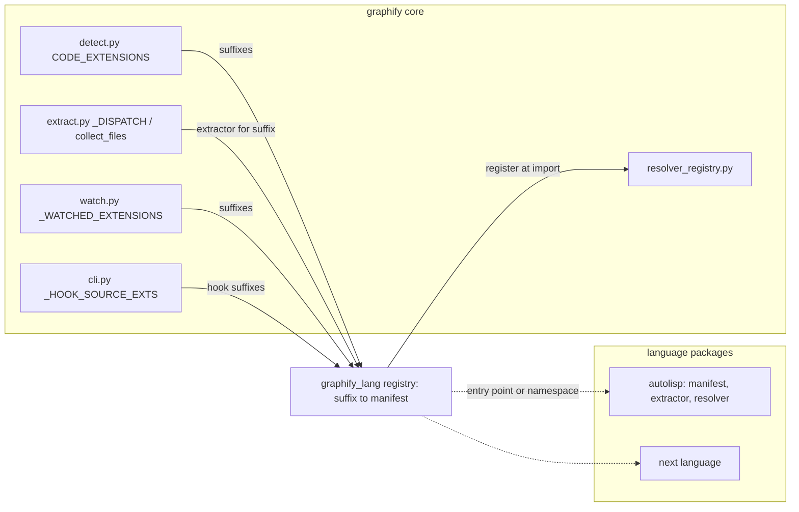

# graphify-lang

A fork of [Graphify-Labs/graphify](https://github.com/Graphify-Labs/graphify)
that adds a language-extension layer to graphify's core, so that a poorly
supported or unsupported language can be added as a self-contained package
instead of by editing the core. The first target language is AutoLISP.

The upstream project's own README is kept verbatim at
[docs/UPSTREAM-README.md](docs/UPSTREAM-README.md). Read that for what graphify
is and how to use it. This file covers only what the fork changes and why.

## What this fork is and is not

This is not a general-purpose graphify fork. It tracks upstream `v8` (the
upstream default branch, tag `v0.9.55` at the fork point) and carries one
change: a way to register a language from outside `graphify/extract.py`. The
core pipeline, the output schema, the CLI, the MCP server, and every existing
language extractor are upstream's and stay upstream's. Anything in the
extension layer that is not AutoLISP-specific is intended to go back upstream
as a pull request, following the seams upstream has already opened for it
(see [Design goals](#design-goals-for-the-extension-layer)). The AutoLISP
package itself may or may not be wanted upstream; it is written so that either
answer works.

## The problem

Two measurements, taken on 7 September 2026 against the fork at `c9f9901`
with the `graphifyy 0.9.55` pipx venv (`tree-sitter 0.25.2`,
`tree-sitter-commonlisp 0.4.1`, Python 3.12.3) and the
[AutoLITHP](https://github.com/p4ndr/autolithp) repository as the corpus.

### AutoLISP files produce a file node and nothing else

graphify routes `.lsp` to the Common Lisp extractor
(`graphify/extract.py:5691`, `".lsp": extract_commonlisp`). Running that
extractor on AutoLITHP's `src/core/err.lsp`, which contains 27 `(defun` forms
(`grep -o '(defun' src/core/err.lsp | wc -l`), returns:

| Input | Nodes | Edges | Instrument |
|:------|------:|------:|:-----------|
| `src/core/err.lsp` (27 defuns) | 1 | 0 | `extract_commonlisp(Path('src/core/err.lsp'))` |
| 79 `.lsp` files under `src/`, `tests/`, `Import-Refactor/` | 79 | 0 | same call per file, summed |

The one node per file is the file node the extractor mints unconditionally
(`graphify/extractors/commonlisp.py:139-140`). No function, no command, no
call, no load.

The loss is in the walker, not the parser. Parsing `err.lsp` with the same
grammar gives a root with zero `ERROR` nodes and these node-type counts
(tree-sitter walk, `Counter` over every node):

| Node type | Count |
|:----------|------:|
| `sym_lit` | 795 |
| `list_lit` | 331 |
| `comment` | 283 |
| `package_lit` | 98 |
| `defun` | 55 |
| `str_lit` | 46 |
| `defun_header` | 28 |

Reading the walker against that tree shows where AutoLISP falls through:

1. `_walk_forms` (`commonlisp.py:493-505`) iterates the root's `list_lit`
   children and `_process_form` (`commonlisp.py:447-451`) hands any
   `list_lit` that wraps a `defun` node to `_handle_defun_node`. That part
   works: all 27 defuns are reached.
2. `_handle_defun_node` (`commonlisp.py:276-286`) takes the function name from
   the first `sym_lit` child of the `defun_header`. In AutoLISP the name is
   `err:trap`, `C:PLTRN`, or similar, and the Common Lisp grammar reads the
   colon as a package qualifier: the header child is a `package_lit`
   (children `sym_lit`, `:`, `sym_lit`), not a `sym_lit`. Measured on
   `err.lsp`: 27 of the 28 `defun_header` nodes carry a `package_lit` name.
   `func_name` stays `None` and the handler returns at `commonlisp.py:285`.
   That single early return accounts for every missing node.
3. Even with the name fixed, calls would still be lost: `walk_calls`
   (`commonlisp.py:518-532`) identifies the callee with `_first_sym`
   (`commonlisp.py:186-191`), which also looks for `sym_lit` only. A call such
   as `(err:_console ...)` at `err.lsp:72` has children `(`, `package_lit`,
   `list_lit`, so it is never a candidate callee.
4. The AutoLISP argument list `(caller fn args / )` parses cleanly: the `/`
   separator is an ordinary `sym_lit`. The walker does not read it, so
   parameters and locals are neither distinguished nor recorded.

Symbols with a module prefix are the norm in AutoLISP, not the exception
(98 `package_lit` nodes in one 27-function file), so this is not an edge case.

### Adding a language costs six edits across five files

Upstream's own procedure (`ARCHITECTURE.md`, 'Adding a new language
extractor') and the code it points at:

| Step | File and line | What you edit |
|:-----|:--------------|:--------------|
| 1 | `graphify/extractors/<lang>.py` | new `extract_<lang>(path) -> dict` |
| 2 | `graphify/extract.py:5630` (`_DISPATCH`) | suffix → extractor |
| 2 | `graphify/extract.py:7578` (`collect_files`, reads `_DISPATCH.keys()`) | same table, so one edit, but it must exist |
| 2 | `graphify/extract.py:5740` (`_EXTRA_FOR_EXTENSION`) | suffix → pip extra, used for the install hint at `extract.py:6371` |
| 3 | `graphify/detect.py:44` (`CODE_EXTENSIONS`) | suffix |
| 3 | `graphify/watch.py:278` (`_WATCHED_EXTENSIONS`, derived from `CODE_EXTENSIONS`) | follows step 3 |
| 4 | `pyproject.toml` | grammar dependency or optional extra |
| 5 | `tests/fixtures/`, `tests/test_languages.py` (4,432 lines) | fixture and tests |

`extract.py` is 7,645 lines and `cli.py` is 4,734. A seventh list,
`_HOOK_SOURCE_EXTS` (`graphify/cli.py:71-75`, consumed at `cli.py:881`),
decides which file suffixes trigger the 'run `graphify query` first' nudge in
the editor hook. It is a fixed tuple with no `.lsp` and no override, so an
AutoLISP file never nudges even when it is in the graph.

Every one of those edits is inside upstream's core, which means every rebase
onto upstream has to carry them, and every language added the same way makes
the next rebase harder.

## Design goals for the extension layer

1. **Plugin discovery outside the core.** A language package is found either
   through a Python entry point (`importlib.metadata.entry_points`, one
   group name) or by being a module under a `graphify_lang/` namespace
   package. No import of a language package from core code.
2. **One manifest per language.** The package declares its suffixes, its
   grammar dependency (a tree-sitter module name or a hand-written parser),
   its extractor, an optional cross-file resolver, and the suffixes that
   should trigger the hook nudge. The core consults the manifest; it does not
   know the language.
3. **Core changes limited to consulting the registry.** The tables listed in
   [the six-edit table](#adding-a-language-costs-six-edits-across-five-files)
   gain one lookup each. No table is rewritten, no existing entry moves.
4. **Zero behaviour change for existing languages.** Every upstream test in
   `tests/` passes unchanged. The registry starts empty; with no language
   package installed the fork behaves as upstream.
5. **Upstream's `MIGRATION.md` invariants are respected.** The extractor split
   in `graphify/extractors/MIGRATION.md` (invariants at lines 36-51) forbids
   importing `graphify.extract` from inside `graphify/extractors/`, requires
   the facade re-export, and reserves 'rewire dispatch' for a later, separate
   step (`MIGRATION.md:102-107`). The extension layer is that later step and
   must not break the earlier ones.
6. **Build on the seams upstream already opened.** Four exist:

| Seam | What it gives an extension author |
|:-----|:----------------------------------|
| `graphify/extractors/__init__.py:34` `LANGUAGE_EXTRACTORS` | a `dict[str, Callable[[Path], dict]]` keyed by language name. Its docstring (`__init__.py:5-6`) calls it 'the registry seed; wiring dispatch through it is a later, separate step'. |
| `graphify/resolver_registry.py:48` `register(LanguageResolver)` | a cross-file resolution pass. `LanguageResolver` (`resolver_registry.py:28-42`) is `name`, `suffixes`, `resolve(per_file, all_nodes, all_edges) -> None`. `run_language_resolvers` (`resolver_registry.py:59-85`) runs each registered pass only when one of its suffixes is present in the corpus, in registration order, catching and logging any exception. `extract.py:21` imports `register` as `register_language_resolver` and uses it at `extract.py:4542` and `4545` for C#. |
| `graphify/extractors/base.py` | `_LANGUAGE_BUILTIN_GLOBALS` (`base.py:13`), the denylist that stops constructor-like built-ins becoming god nodes; `_make_id` (`base.py:54`); `_file_stem` (`base.py:58`), which derives the path-qualified id prefix so same-named files in different directories do not collide; `_read_text` (`base.py:84`). The header comment (`base.py:1`) fixes the import direction: `extract.py` → `extractors/`, never back. |
| `graphify/extractors/models.py` | `LanguageConfig` (`models.py:14-57`), the dataclass that drives the shared `_extract_generic` core in `engine.py` for tree-sitter grammars with conventional class/function/import/call node types, plus the `_Symbol*Fact` records (`models.py:59-131`) that the cross-file resolution in `resolution.py` consumes. |

`engine.py` (6,303 lines) is the config-driven extractor core and
`resolution.py` (3,309 lines) the cross-file symbol resolution; both are
imported by `extract.py:149`. A language whose grammar fits `LanguageConfig`
can reuse `engine.py` wholesale. AutoLISP does not fit it (its names are
`package_lit`, its definer is a dedicated node type), which is why the
manifest must allow a bespoke extractor as well as a config.

## Proposed architecture

The core keeps its tables; each table gains a lookup into one registry, and
the registry is populated from language packages the core never imports by
name.



The language-package contract, as a manifest. 'Where the core reads it' names
the existing table each field feeds.

| Field | Required | Type | Where the core reads it |
|:------|:---------|:-----|:------------------------|
| `name` | yes | `str` | registry key, same role as the `LANGUAGE_EXTRACTORS` key (`graphify/extractors/__init__.py:34`) |
| `suffixes` | yes | `frozenset[str]` | `_DISPATCH` (`extract.py:5630`), `collect_files` (`extract.py:7578`), `CODE_EXTENSIONS` (`graphify/detect.py:44`), `_WATCHED_EXTENSIONS` (`graphify/watch.py:278`) |
| `extract` | yes | `Callable[[Path], dict]` | `_DISPATCH` value; must return the schema in `ARCHITECTURE.md` ('Extraction output schema'), enforced by `validate.py` |
| `grammar` | no | tree-sitter module name, or `None` for a hand parser | the package's own import. The core sees only the `error` key convention when the grammar is absent (`commonlisp.py:66`) |
| `extra` | no | `str` | `_EXTRA_FOR_EXTENSION` (`extract.py:5740`), so the missing-grammar hint at `extract.py:6371` names the right `pip install "graphifyy[...]"` |
| `resolver` | no | `LanguageResolver` | `register_language_resolver` (`extract.py:21`, `resolver_registry.py:48`) |
| `hook_suffixes` | no | `tuple[str, ...]` | `_HOOK_SOURCE_EXTS` (`cli.py:71`), consumed at `cli.py:881` |
| `fixture` | no | path | the package's own tests; the core's `tests/test_languages.py` is not edited |

Open questions the design has to settle before code, each with the options
on the table:

1. Discovery: entry point only, namespace package only, or both. Entry
   points work for installed packages; a namespace package also works for a
   checked-out directory on `sys.path`.
2. Registration time: at `graphify.extract` import, or lazily on first
   `_DISPATCH` miss. Import-time is simpler and matches how the C# resolvers
   register (`extract.py:4542`); lazy avoids paying for packages that are
   never used.
3. Precedence: whether a package may claim a suffix the core already owns
   (`.lsp` is the case in point, `extract.py:5691`). The AutoLISP package
   needs to.

## AutoLISP

### Current state

Measured in [The problem](#the-problem): one file node per `.lsp` file, zero
edges, on a corpus of 79 files. `.dcl` and `.mnl` are not recognised
suffixes anywhere in `extract.py`, `detect.py`, or `watch.py` (`grep` for
`".dcl"` and `".mnl"` in those three files returns nothing), so dialog files
are not scanned at all.

### Language traits an extractor must know

AutoLISP is not Common Lisp. These are the traits that matter for a graph,
with an example from AutoLITHP where one exists:

| Trait | Form | Example |
|:------|:-----|:--------|
| Case-insensitive symbols | `err:trap` and `ERR:TRAP` are one symbol | convention throughout |
| Definition | `(defun name (params / locals) body)` | `src/core/err.lsp:161` `(defun err:trap (caller fn args / )` |
| Command | `(defun C:NAME ...)` defines a command the user types | `src/core/ldr.lsp:541` `(defun C:LITHP (/ )` |
| Module prefix | `mod:kebab-case` names, one prefix per module | `err:`, `utl:`, `cfg:` |
| Global | `*mod:name*` | `src/core/err.lsp:16` `(setq *err:debug* nil)` |
| Multi-pair `setq` | `(setq a 1 b 2)` | language rule |
| Load | `(load "file")`, or a wrapper such as `err:safe-load` | `src/core/ldr.lsp:235` |
| COM | `(vl-load-com)` then `vla-`/`vlax-` calls | `src/core/ldr.lsp:275`, `src/core/utl.lsp:320` |
| AutoCAD command | `(command "_.UNDO" "_End")` | `src/plugins/pltidy.lsp:553` |
| Quoted function reference | `'fn` passed to `vl-catch-all-apply`, `mapcar`, `apply`, or a wrapper | `src/core/err.lsp:91` `(vl-catch-all-apply 'log:add ...)`, `src/core/ldr.lsp:305` `(mapcar 'car ...)` |
| DCL dialog | `.dcl` defines `name : dialog { ... }`; code opens it with `(load_dialog f)` and `(new_dialog "name" id)` | `src/ui/manager.dcl:3` `lithp_mgr : dialog {`, `src/plugins/pltrn.lsp:10903` and `:10907` |
| DCL action | `(action_tile "key" "(fn) ...")` links a tile to code through a string | `src/plugins/pltrn.lsp:10882` |
| Module header | `;;; @module`, `@prefix`, `@depends` comment block | `src/modules/lyr/mod.lsp:6-9` |
| Sidecar doc | `;;; @sidecar x.md`, `;;; @doc x.md#Cnnnn` | `src/core/err.lsp:1`, `src/modules/lyr/mod.lsp:11` |

Two of these carry a warning for the extractor. The `load_dialog` argument at
`pltrn.lsp:10903` is a variable, not a string literal, so the file edge is at
best `INFERRED`; the dialog name at `:10907` is a literal and can be
`EXTRACTED`. And the `action_tile` callback is code inside a string, so it
needs a second read of the string body, not the surrounding tree.

### Target node and edge model

This is the target, not what exists. Relation names follow the
`ARCHITECTURE.md` schema (`relation` plus a confidence label).

| Node kind | Source form |
|:----------|:------------|
| file | every `.lsp`, `.dcl`, `.mnl` |
| function | `(defun name ...)` |
| command | `(defun C:NAME ...)` |
| global | top-level `(setq *name* ...)` |
| module | `@module` header |
| dialog | `name : dialog {` in a `.dcl` file |
| sidecar doc | the `.md` named by `@sidecar` or `@doc` |

| Relation | From → to | Source form | Confidence |
|:---------|:----------|:------------|:-----------|
| `contains` | file → function, command, global | position in file | `EXTRACTED` |
| `defines` | module → function | `@prefix` matched against the name prefix | `INFERRED` |
| `calls` | function → function | `(name ...)` in the body | `EXTRACTED` |
| `calls` | function → function | `'name` in a quoted position | `EXTRACTED` |
| `loads` | file → file | `(load "x")`; wrapper with a literal | `EXTRACTED`; computed path `INFERRED` |
| `dcl_references` | function → dialog | `(new_dialog "name" id)` | `EXTRACTED` |
| `dcl_action` | dialog → function | `(action_tile "key" "(fn)")` | `EXTRACTED` |
| `command_invokes` | function → AutoCAD command stub | `(command "_.X" ...)` | `EXTRACTED` |
| `module_depends` | module → module | `@depends` list | `EXTRACTED` |
| `sidecar_doc` | file or function → sidecar doc | `@sidecar`, `@doc` | `EXTRACTED` |

Whether `vla-`/`vlax-` COM calls become edges to stub nodes or go on a
built-ins denylist (the `_LANGUAGE_BUILTIN_GLOBALS` pattern, `base.py:13`)
is a decision for the first measurement: they appear in most files and would
otherwise become god nodes.

### Parser options

| Option | For | Against |
|:-------|:----|:--------|
| Reuse `tree-sitter-commonlisp` with an AutoLISP-aware walker | already a dependency (`pyproject.toml:97`, `:126`); parses `err.lsp` with zero `ERROR` nodes; `package_lit` and `defun_header` give the name and the argument list directly | the grammar is Common Lisp's: `package_lit` is a mis-reading of the prefix, `#` reader syntax and `\|` symbols are not AutoLISP's, and DCL is a different language the grammar cannot read at all |
| A hand-written s-expression reader | AutoLISP's surface syntax is small; AutoLITHP already has one, `tools/lread.py`, 72 lines, that returns nested forms with line numbers; the same reader can be extended to DCL's `name : type { key = value; }` blocks | no incremental parsing, no error recovery, and every construct is the fork's to maintain |
| A new `tree-sitter-autolisp` grammar | a grammar is the form every other extractor uses, and would give AutoLISP the same tooling elsewhere | there is none to reuse; writing, packaging, and publishing wheels is a project of its own |

The measured facts favour starting with the first option and keeping the
walker separate from `commonlisp.py`, so that the Common Lisp extractor is
never edited. The hand reader is the fallback for DCL either way.

### Acceptance test

All against AutoLITHP, all mechanical, none of them satisfied at the fork point:

| Check | Expected | Instrument |
|:------|:---------|:-----------|
| Function nodes from `src/core/err.lsp` | 27 | `len` of nodes with `file_type == "code"` and a `defun` origin, from `extract(...)` on that file |
| `C:` commands appear | `C:LITHP`, `C:LITHP-MGR`, `C:LITHP-INIT` from `src/core/ldr.lsp:526-541` | node labels |
| A prefixed name is one symbol | `err:trap` is one node, not `err` plus `trap` | node ids |
| DCL edges | at least one `dcl_references` edge into `lithp_mgr` from `src/ui/manager.dcl:3` | edge list |
| No upstream regression | `pytest tests/ -q` exit 0 with no test file edited | pytest |

## Roadmap

Phases, each with an exit criterion. No dates.

1. **Registry and manifest.** Define the manifest dataclass and the discovery
   mechanism; add the lookups to the five core tables. Exit: `pytest tests/
   -q` passes unchanged, and a stub language package registered from a test
   is dispatched for its suffix.
2. **AutoLISP nodes.** An AutoLISP extractor that claims `.lsp` and produces
   file, function, command, and global nodes with `contains` edges. Exit:
   27 function nodes and 3 command nodes from `err.lsp` and `ldr.lsp`.
3. **AutoLISP edges.** `calls` (direct and quoted), `loads`,
   `module_depends`, `sidecar_doc`. Exit: `err:trap` has at least one
   inbound `calls` edge from another file in the corpus.
4. **DCL.** A `.dcl` reader, dialog nodes, `dcl_references` and `dcl_action`
   edges. Exit: the `lithp_mgr` check in the acceptance table.
5. **Hook and watch.** `.lsp` and `.dcl` in the nudge and watch lists via the
   manifest. Exit: editing a `.lsp` file under a graphed project triggers the
   nudge at `cli.py:881`.
6. **Upstream.** Split the generic registry from the AutoLISP package and
   open a pull request for the registry alone. Exit: the PR is open and the
   fork's diff against upstream is the AutoLISP package plus that PR.

## Repository layout

Directories that exist are upstream's. Planned directories are marked.

| Path | Status | Purpose |
|:-----|:-------|:--------|
| `graphify/` | upstream | the core; `extract.py`, `detect.py`, `watch.py`, `cli.py`, `resolver_registry.py` |
| `graphify/extractors/` | upstream | per-language extractors, `base.py`, `models.py`, `engine.py`, `resolution.py`, `MIGRATION.md` |
| `tests/` | upstream | one file per module; `test_languages.py`, `test_extractors_registry.py`, `fixtures/` |
| `docs/` | upstream, plus this fork's `UPSTREAM-README.md` | upstream docs and translations |
| `.claude/` | fork | `CLAUDE.md` and the harness docs, tracked here although upstream's `.gitignore:19` ignores the directory |
| `graphify_lang/` | planned | the registry and manifest; the namespace root for language packages |
| `graphify_lang/autolisp/` | planned | manifest, extractor, DCL reader, resolver, fixtures, tests |

## Working with upstream

Upstream's default branch is `v8` (`git remote show upstream`). The fork's
`v8` is at the same commit as `upstream/v8` (`git rev-list --count
upstream/v8..v8` is 0). Upstream's `main` is stale (last commit
2026-05-14) and is not the branch to track.

To update:

```bash
git fetch upstream
git rebase upstream/v8
```

Rules:

1. Fork work goes on branches off `v8`, never on `v8` itself, so `v8` can
   always fast-forward to upstream.
2. Rebase, do not merge. The fork's value is a small diff against upstream;
   merge commits hide it.
3. Never edit an existing language extractor, `engine.py`, or
   `resolution.py`. Never add an entry to `_DISPATCH`, `CODE_EXTENSIONS`,
   or `_HOOK_SOURCE_EXTS` by hand; the registry lookup is the only permitted
   change to those tables.
4. `ARCHITECTURE.md` is test-pinned: `tests/test_architecture_doc.py`
   imports every symbol it names. A new public entry point must be added to
   both or the test fails.
5. To send a change upstream: rebase the branch onto `upstream/v8`, confirm
   `pytest tests/ -q` passes, keep to one concern per PR as
   `graphify/extractors/MIGRATION.md` asks, and open the PR against
   `Graphify-Labs/graphify` branch `v8`.

## Development setup

The package name on PyPI and in `pyproject.toml:6` is `graphifyy`; the import
name is `graphify`; the CLI entry points are `graphify` and `graphify-mcp`
(`pyproject.toml:104-106`). Python 3.10 or later (`pyproject.toml:13`).

The user-facing install on this host is a pipx venv at
`~/.local/share/pipx/venvs/graphifyy` (`graphifyy 0.9.55`, Python 3.12.3,
`tree-sitter-commonlisp 0.4.1` present). That venv is left alone. The plan is
an editable install of the fork into a separate venv:

```bash
python3 -m venv ~/.venvs/graphify-lang
~/.venvs/graphify-lang/bin/pip install -e ".[commonlisp]" pytest
~/.venvs/graphify-lang/bin/pytest tests/ -q
```

`uv` is not installed on this host (`which uv` returns nothing); `pipx` is
(`/usr/bin/pipx`). `pyproject.toml:129-130` documents `uv tool install
graphifyy` as upstream's route, and `pipx install -e .` is the equivalent
here if a second CLI is wanted on `PATH`.

## Status

No code yet. As of 2026-09-07 the fork consists of this README, the moved
upstream README, and `.claude/CLAUDE.md`.
