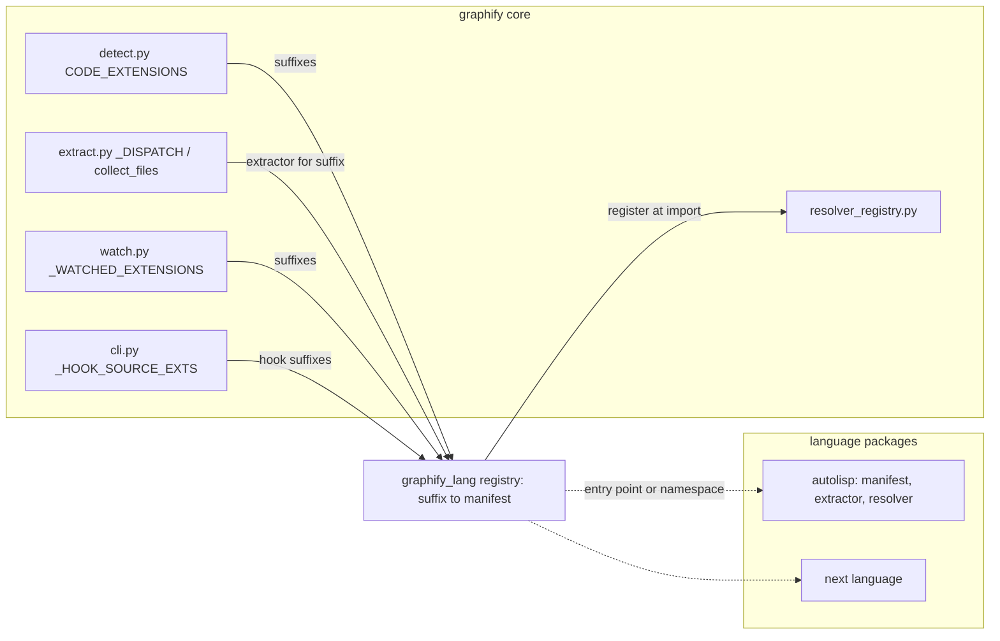

# graphify-lang

A fork of [Graphify-Labs/graphify](https://github.com/Graphify-Labs/graphify)
that adds a language-extension layer to graphify's core, so that a poorly
supported or unsupported language can be added as a self-contained package
instead of by editing the core. The first target language is AutoLISP.

The upstream project's own README is kept verbatim at
[docs/UPSTREAM-README.md](docs/UPSTREAM-README.md). Read that for what graphify
is and how to use it. This file covers only what the fork changes and why.

## What this fork is and is not

This is not a general-purpose graphify fork. It tracks upstream `v8` (the
upstream default branch) by rebase, and carries one change: a way to register
a language from outside `graphify/extract.py`, plus the language packages
built on it. The core pipeline, the output schema, the CLI, the MCP server,
and every existing language extractor are upstream's and stay upstream's. Anything in the
extension layer that is not AutoLISP-specific is intended to go back upstream
as a pull request, following the seams upstream has already opened for it
(see [Design goals](#design-goals-for-the-extension-layer)). The AutoLISP
package itself may or may not be wanted upstream; it is written so that either
answer works.

## The problem

Two measurements that motivated the fork, taken on 7 September 2026 against
the fork point `c9f9901` with the stock graphify then installed by pipx
(`tree-sitter 0.25.2`, `tree-sitter-commonlisp 0.4.1`, Python 3.12.3) and the
[AutoLITHP](https://github.com/p4ndr/autolithp) repository as the corpus. Line
numbers in this section are those of `c9f9901`; the section is a record, not
the current state (see [Status](#status)).

### AutoLISP files produce a file node and nothing else

graphify routes `.lsp` to the Common Lisp extractor (the `_DISPATCH` entry
`".lsp": extract_commonlisp` in `graphify/extract.py`). Running that
extractor on AutoLITHP's `src/core/err.lsp`, which contains 27 `(defun` forms
(`grep -o '(defun' src/core/err.lsp | wc -l`), returns:

| Input | Nodes | Edges | Instrument |
|:------|------:|------:|:-----------|
| `src/core/err.lsp` (27 defuns) | 1 | 0 | `extract_commonlisp(Path('src/core/err.lsp'))` |
| 79 `.lsp` files under `src/`, `tests/`, `Import-Refactor/` | 79 | 0 | same call per file, summed |

The one node per file is the file node the extractor mints unconditionally
(`graphify/extractors/commonlisp.py:139-140`). No function, no command, no
call, no load.

The loss is in the walker, not the parser. Parsing `err.lsp` with the same
grammar gives a root with zero `ERROR` nodes and these node-type counts
(tree-sitter walk, `Counter` over every node):

| Node type | Count |
|:----------|------:|
| `sym_lit` | 795 |
| `list_lit` | 331 |
| `comment` | 283 |
| `package_lit` | 98 |
| `defun` | 55 |
| `str_lit` | 46 |
| `defun_header` | 28 |

Reading the walker against that tree shows where AutoLISP falls through:

1. `_walk_forms` (`commonlisp.py:493-505`) iterates the root's `list_lit`
   children and `_process_form` (`commonlisp.py:447-451`) hands any
   `list_lit` that wraps a `defun` node to `_handle_defun_node`. That part
   works: all 27 defuns are reached.
2. `_handle_defun_node` (`commonlisp.py:276-286`) takes the function name from
   the first `sym_lit` child of the `defun_header`. In AutoLISP the name is
   `err:trap`, `C:PLTRN`, or similar, and the Common Lisp grammar reads the
   colon as a package qualifier: the header child is a `package_lit`
   (children `sym_lit`, `:`, `sym_lit`), not a `sym_lit`. Measured on
   `err.lsp`: 27 of the 28 `defun_header` nodes carry a `package_lit` name.
   `func_name` stays `None` and the handler returns at `commonlisp.py:285`.
   That single early return accounts for every missing node.
3. Even with the name fixed, calls would still be lost: `walk_calls`
   (`commonlisp.py:518-532`) identifies the callee with `_first_sym`
   (`commonlisp.py:186-191`), which also looks for `sym_lit` only. A call such
   as `(err:_console ...)` at `err.lsp:72` has children `(`, `package_lit`,
   `list_lit`, so it is never a candidate callee.
4. The AutoLISP argument list `(caller fn args / )` parses cleanly: the `/`
   separator is an ordinary `sym_lit`. The walker does not read it, so
   parameters and locals are neither distinguished nor recorded.

Symbols with a module prefix are the norm in AutoLISP, not the exception
(98 `package_lit` nodes in one 27-function file), so this is not an edge case.

### Adding a language costs six edits across five files

Upstream's own procedure (`ARCHITECTURE.md`, 'Adding a new language
extractor') and the code it points at:

| Step | File and symbol | What you edit |
|:-----|:----------------|:--------------|
| 1 | `graphify/extractors/<lang>.py` | new `extract_<lang>(path) -> dict` |
| 2 | `graphify/extract.py`, `_DISPATCH` | suffix → extractor |
| 2 | `graphify/extract.py`, `collect_files` (reads `_DISPATCH.keys()`) | same table, so one edit, but it must exist |
| 2 | `graphify/extract.py`, `_EXTRA_FOR_EXTENSION` | suffix → pip extra, used for the missing-grammar install hint in `extract` |
| 3 | `graphify/detect.py`, `CODE_EXTENSIONS` | suffix |
| 3 | `graphify/watch.py`, `_WATCHED_EXTENSIONS` (derived from `CODE_EXTENSIONS`) | follows step 3 |
| 4 | `pyproject.toml` | grammar dependency or optional extra |
| 5 | `tests/fixtures/`, `tests/test_languages.py` (4,432 lines) | fixture and tests |

`extract.py` was 7,645 lines and `cli.py` 4,734. A seventh list,
`_HOOK_SOURCE_EXTS` (`graphify/cli.py`, read by the editor-hook handler),
decides which file suffixes trigger the 'run `graphify query` first' nudge in
the editor hook. It is a fixed tuple with no `.lsp` and no override, so an
AutoLISP file never nudges even when it is in the graph.

Every one of those edits is inside upstream's core, which means every rebase
onto upstream has to carry them, and every language added the same way makes
the next rebase harder.

## Design goals for the extension layer

1. **Plugin discovery outside the core.** A language package is found either
   through a Python entry point (`importlib.metadata.entry_points`, one
   group name) or by being a module under a `graphify_lang/` namespace
   package. No import of a language package from core code.
2. **One manifest per language.** The package declares its suffixes, its
   grammar dependency (a tree-sitter module name or a hand-written parser),
   its extractor, an optional cross-file resolver, and the suffixes that
   should trigger the hook nudge. The core consults the manifest; it does not
   know the language.
3. **Core changes limited to consulting the registry.** The tables listed in
   [the six-edit table](#adding-a-language-costs-six-edits-across-five-files)
   gain one lookup each. No table is rewritten, no existing entry moves.
4. **Zero behaviour change for existing languages.** Every upstream test in
   `tests/` passes unchanged. The registry starts empty; with no language
   package installed the fork behaves as upstream.
5. **Upstream's `MIGRATION.md` invariants are respected.** The extractor split
   in `graphify/extractors/MIGRATION.md` (invariants at lines 36-51) forbids
   importing `graphify.extract` from inside `graphify/extractors/`, requires
   the facade re-export, and reserves 'rewire dispatch' for a later, separate
   step (`MIGRATION.md:102-107`). The extension layer is that later step and
   must not break the earlier ones.
6. **Build on the seams upstream already opened.** Four exist:

| Seam | What it gives an extension author |
|:-----|:----------------------------------|
| `graphify/extractors/__init__.py`, `LANGUAGE_EXTRACTORS` | a `dict[str, Callable[[Path], dict]]` keyed by language name. Its module docstring calls it 'the registry seed; wiring dispatch through it is a later, separate step'. |
| `graphify/resolver_registry.py`, `register(LanguageResolver)` | a cross-file resolution pass. `LanguageResolver` is `name`, `suffixes`, `resolve(per_file, all_nodes, all_edges) -> None`. `run_language_resolvers` runs each registered pass only when one of its suffixes is present in the corpus, in registration order, catching and logging any exception. `extract.py` imports `register` as `register_language_resolver` and uses it for C#. |
| `graphify/extractors/base.py` | `_LANGUAGE_BUILTIN_GLOBALS`, the denylist that stops constructor-like built-ins becoming god nodes; `_make_id`; `_file_stem`, which derives the path-qualified id prefix so same-named files in different directories do not collide; `_read_text`. The header comment fixes the import direction: `extract.py` → `extractors/`, never back. |
| `graphify/extractors/models.py` | `LanguageConfig`, the dataclass that drives the shared `_extract_generic` core in `engine.py` for tree-sitter grammars with conventional class/function/import/call node types, plus the `_Symbol*Fact` records that the cross-file resolution in `resolution.py` consumes. |

`engine.py` is the config-driven extractor core and `resolution.py` the
cross-file symbol resolution; `extract.py` imports both. A language whose grammar fits `LanguageConfig`
can reuse `engine.py` wholesale. AutoLISP does not fit it (its names are
`package_lit`, its definer is a dedicated node type), which is why the
manifest must allow a bespoke extractor as well as a config.

## Architecture

The core keeps its tables; each table gains a lookup into one registry, and
the registry is populated from language packages the core never imports by
name.



The language-package contract, as a manifest. 'Where the core reads it' names
the existing table each field feeds.

| Field | Required | Type | Where the core reads it |
|:------|:---------|:-----|:------------------------|
| `name` | yes | `str` | registry key, same role as the `LANGUAGE_EXTRACTORS` key (`graphify/extractors/__init__.py`) |
| `suffixes` | yes | `frozenset[str]` | `_DISPATCH` and `collect_files` (`extract.py`), `CODE_EXTENSIONS` (`detect.py`), `_WATCHED_EXTENSIONS` (`watch.py`) |
| `extract` | yes | `Callable[[Path], dict]` | `_DISPATCH` value; must return the schema in `ARCHITECTURE.md` ('Extraction output schema'), enforced by `validate.py` |
| `grammar` | no | tree-sitter module name, or `None` for a hand parser | the package's own import. The core sees only the `error` key convention when the grammar is absent (as `extract_commonlisp` returns it) |
| `extra` | no | `str` | `_EXTRA_FOR_EXTENSION` (`extract.py`), so the missing-grammar hint names the right `pip install "graphifyy[...]"` |
| `resolver` | no | `LanguageResolver` | `register` in `resolver_registry.py` (`register_language_resolver` in `extract.py`) |
| `hook_suffixes` | no | `tuple[str, ...]` | `_HOOK_SOURCE_EXTS` (`cli.py`) |
| `[resolve] context_fields` | no | `list[str]`, default `["node_kind"]` | the incremental context nodes in `watch._rebuild_code` and the `graphify extract` incremental path (`cli.py`); see [Plugin contract](#plugin-contract) |
| `fixture` | no | path | the package's own tests; the core's `tests/test_languages.py` is not edited |
| `overrides` | no | suffixes | wins that suffix from the built-in with no sniff (`.lsp`) |
| `priority` | no | `int` | breaks a sniff tie between plugins (higher wins) |
| `[sniff]` | no | `head_bytes`, `rules = [{ re, weight, flags }]`, `min_score` | the sniff router, for a suffix with more than one claimant |
| `[match]` | no | `globs`, `filenames` | the router, and the `classify_file` hook for data suffixes |
| `kind`, `augments` | no | `"language"` or `"augment"`, suffixes | an augment adds to a suffix's extractor output |

### Shared suffixes, data files and augments

Plan 04 (`docs/plans/04-content-sniffing-augment-plugins-and-five-new-languages.md`)
settles open question 3 below. The code is `graphify_lang/registry.py`
(`dispatch_table`, `claims_file`) and `graphify/lang_registry.py`
(`apply_dispatch`, `claims_file`).

- **Claimants per suffix.** The built-in (`_DISPATCH` before plugins run,
  kept as `lang_registry._BUILTIN_DISPATCH`) plus every plugin that lists
  the suffix. The fallback is an `overrides` plugin, else the built-in, else
  the first plugin with no `[sniff]` or `[match]`.
- **Router.** When a plugin with `[sniff]` or `[match]` shares a suffix,
  `_DISPATCH[suffix]` is `sniff_router[<suffix>]`. It reads the file head
  once and calls the plugin with the highest score at or above its
  `min_score`, then the higher `priority`, then the first registered (one
  tie warning per suffix). Otherwise it calls the fallback, or returns an
  empty result when there is none. A NUL byte in the head, or an empty file,
  never passes a sniff. A UTF-8 BOM is stripped before `^` rules run.
- **Data suffixes.** A suffix claimed only through `[match]` is not added to
  `CODE_EXTENSIONS`. `classify_file` asks `lang_registry.claims_file(path)`
  first; a file is CODE only when a glob or filename and the sniff pass.
  Globs match the path at any `/` boundary, because `classify_file` does not
  get the scan root.
- **Augments.** `kind = "augment"` wraps the suffix's extractor (built-in or
  router) as `augmented[<suffix>]`. The augment returns `nodes`, `edges`
  and `attrs` keyed by base node id; new ids must start with the plugin
  name prefix, and no base node or attribute is replaced.
- `graphify lang list` shows a `sniff` column, `*` after a shared suffix and
  `+` before an augmented one. `graphify lang list --check` prints one row
  per plugin, `ok` or its load error, and exits 1 when any plugin failed.
- **Discovery.** The `graphify_lang_plugins` entry points, then every
  `*.toml` manifest in each `GRAPHIFY_LANG_PATH` folder (`os.pathsep`
  separated). A path manifest's `[extract] runtime` module is imported with
  its folder first on `sys.path` and exposes `extract` (or `augment`) and
  an optional `RESOLVER`. A plugin that fails to load is logged and skipped;
  `GRAPHIFY_LANG_DISABLE=1` turns discovery off.

The three design questions the first version of this README left open are
settled:

1. **Discovery**: the `graphify_lang_plugins` entry points, plus manifest
   folders on `GRAPHIFY_LANG_PATH`. There is no namespace-package scan.
2. **Registration time**: at import of the core module that owns each table
   (`detect.py`, `extract.py`, `cli.py`), through `apply_registry()`, which
   loads the registry once.
3. **Precedence**: a plugin may take a built-in suffix with `overrides`
   (AutoLISP takes `.lsp`), or share it through `[sniff]` / `[match]`.

### Plugin contract

Rules every language package follows. The tests named in brackets fail when
a plugin breaks one.

- **Pure extractors and augments.** An extractor or an augment is a function
  of the file's bytes alone: it never reads another file, the scan root, or
  the environment. The AST cache keys on file content, so anything that looks
  at another file is served stale from the cache. Cross-file work belongs in
  the resolver. [`tests/lang/test_s4_build_coherence.py`, `test_h3_*`, `test_m2_*`]
- **Index refs.** A resolver ref records `node`, the index of its source node
  in the file's result, not the id. Upstream renames colliding ids in place
  before resolvers run, so a stored id can dangle; `graphify_lang._common`
  (`Sink.ref`, `refs_of`, `resolve_ref_id`) reads the current id back.
  [`tests/lang/test_s3_shared_core.py`, `test_h2_*`]
- **Augments add, never replace.** An augment returns `nodes`, `edges` and
  `attrs` keyed by base node id; new ids start with the plugin name prefix,
  and no base node or attribute is replaced.
- **`[resolve] context_fields`.** On an incremental build a resolver sees an
  unchanged file only as a context node read from `graph.json`: no payloads,
  few edges, and a root-relative `source_file`. A cross-file fact a resolver
  needs from an unchanged file must be a node field listed in
  `context_fields` (bmake `bmake_includes`, cc-kb `cc_kb_links`, cargo
  `cargo_ws_deps`). The core hook forwards those fields and adds
  `_lang_source_file`, the absolute path.
- **`source_of`.** A resolver compares node paths through
  `graphify_lang._common.source_of(node)`, never `node["source_file"]`
  directly, so fresh and context nodes compare alike.
  [`tests/lang/test_s4_build_coherence.py::test_e5_incremental_parity`]
- **`GRAPHIFY_LANG_PATH`.** Folders (`os.pathsep` separated) whose `*.toml`
  manifests are loaded after the entry points. A manifest's `[extract]
  runtime` module is imported with its folder first on `sys.path` and exposes
  `extract` (or `augment`) and an optional `RESOLVER`. A name already
  registered is rejected and logged.
- **`graphify lang list --check`** prints one row per plugin, `ok` or its
  load error, and exits 1 when any plugin failed to load. A failing plugin
  is logged and skipped; the others still load.

Known limits:

- **Incremental builds miss edges into newly added files.** An incremental
  build re-resolves only the changed files, so an edge owned by an unchanged
  file (an unchanged hub's `cites`, a workspace's `has_member`, a `calls` from
  an unchanged file) into a newly added file appears only on the next full
  build. This is upstream's incremental model, not a plugin defect.
- **Toggling `GRAPHIFY_LANG_DISABLE` re-extracts once.** The AST cache
  namespace carries a fingerprint of the loaded plugin set (names, code, and
  `GRAPHIFY_LANG_PATH` folders), so the first build after the plugin set
  changes, including turning discovery off or on, re-extracts every file.
  Later builds with the same set reuse the cache.

### Upstream seams the fork depends on

Each is a behaviour of upstream code the plugins rely on; an upstream change
to one breaks a plugin silently. The E5 parity test covers most of them.

| Seam | Where | Relied on by |
|:-----|:------|:-------------|
| Colliding ids are renamed in place before resolvers run | `_disambiguate_colliding_node_ids` (`extractors/resolution.py`), called from `extract` | the index-ref contract |
| Incremental context nodes carry a fixed field list | `watch._rebuild_code`, the `graphify extract` incremental path | the `context_fields` hooks (upstream PR draft: `docs/upstream/`) |
| Markdown link reconciliation prunes only `references` edges | `watch._reconcile_markdown_links` | cc-kb `cites` edges surviving |
| `per_file` and `all_nodes` share node dicts | `extract` | bmake, astgrep and cc-kb index reads |
| Suffix fallback for extractor lookup | `_get_extractor` | the registry dispatch and augment hooks |
| Resolver suffix match | `run_language_resolvers` | upper-case suffixes (the fork case-folds; upstream PR draft) |

## AutoLISP

### Current state

The `autolisp` and `autolisp-dcl` plugins (`graphify_lang/autolisp/`) claim
`.lsp` (over the built-in Common Lisp extractor), `.mnl` and `.dcl`, and
produce the node and edge model below. At the fork point, stock graphify gave
one file node per `.lsp` file and zero edges ([The problem](#the-problem)),
and did not scan `.dcl` or `.mnl` at all.

### Language traits an extractor must know

AutoLISP is not Common Lisp. These are the traits that matter for a graph,
with an example from AutoLITHP where one exists:

| Trait | Form | Example |
|:------|:-----|:--------|
| Case-insensitive symbols | `err:trap` and `ERR:TRAP` are one symbol | convention throughout |
| Definition | `(defun name (params / locals) body)` | `src/core/err.lsp:161` `(defun err:trap (caller fn args / )` |
| Command | `(defun C:NAME ...)` defines a command the user types | `src/core/ldr.lsp:541` `(defun C:LITHP (/ )` |
| Module prefix | `mod:kebab-case` names, one prefix per module | `err:`, `utl:`, `cfg:` |
| Global | `*mod:name*` | `src/core/err.lsp:16` `(setq *err:debug* nil)` |
| Multi-pair `setq` | `(setq a 1 b 2)` | language rule |
| Load | `(load "file")`, or a wrapper such as `err:safe-load` | `src/core/ldr.lsp:235` |
| COM | `(vl-load-com)` then `vla-`/`vlax-` calls | `src/core/ldr.lsp:275`, `src/core/utl.lsp:320` |
| AutoCAD command | `(command "_.UNDO" "_End")` | `src/plugins/pltidy.lsp:553` |
| Quoted function reference | `'fn` passed to `vl-catch-all-apply`, `mapcar`, `apply`, or a wrapper | `src/core/err.lsp:91` `(vl-catch-all-apply 'log:add ...)`, `src/core/ldr.lsp:305` `(mapcar 'car ...)` |
| DCL dialog | `.dcl` defines `name : dialog { ... }`; code opens it with `(load_dialog f)` and `(new_dialog "name" id)` | `src/ui/manager.dcl:3` `lithp_mgr : dialog {`, `src/plugins/pltrn.lsp:10903` and `:10907` |
| DCL action | `(action_tile "key" "(fn) ...")` links a tile to code through a string | `src/plugins/pltrn.lsp:10882` |
| Module header | `;;; @module`, `@prefix`, `@depends` comment block | `src/modules/lyr/mod.lsp:6-9` |
| Sidecar doc | `;;; @sidecar x.md`, `;;; @doc x.md#Cnnnn` | `src/core/err.lsp:1`, `src/modules/lyr/mod.lsp:11` |

Two of these carry a warning for the extractor. The `load_dialog` argument at
`pltrn.lsp:10903` is a variable, not a string literal, so the file edge is at
best `INFERRED`; the dialog name at `:10907` is a literal and can be
`EXTRACTED`. And the `action_tile` callback is code inside a string, so it
needs a second read of the string body, not the surrounding tree.

### Target node and edge model

Implemented in plans 01 and 02; measured in
`docs/testing/case_004_plan02-autolisp-fixes.md`. Relation names follow the
`ARCHITECTURE.md` schema (`relation` plus a confidence label).

| Node kind | Source form |
|:----------|:------------|
| file | every `.lsp`, `.dcl`, `.mnl` |
| function | `(defun name ...)` |
| command | `(defun C:NAME ...)` |
| global | top-level `(setq *name* ...)` |
| module | `@module` header |
| dialog | `name : dialog {` in a `.dcl` file |
| sidecar doc | the `.md` named by `@sidecar` or `@doc` |

| Relation | From → to | Source form | Confidence |
|:---------|:----------|:------------|:-----------|
| `contains` | file → function, command, global | position in file | `EXTRACTED` |
| `defines` | module → function | `@prefix` matched against the name prefix | `INFERRED` |
| `calls` | function → function | `(name ...)` in the body | `EXTRACTED` |
| `calls` | function → function | `'name` in a quoted position | `EXTRACTED` |
| `loads` | file → file | `(load "x")`; wrapper with a literal | `EXTRACTED`; computed path `INFERRED` |
| `dcl_references` | function → dialog | `(new_dialog "name" id)` | `EXTRACTED` |
| `dcl_action` | dialog → function | `(action_tile "key" "(fn)")` | `EXTRACTED` |
| `command_invokes` | function → AutoCAD command stub | `(command "_.X" ...)` | `EXTRACTED` |
| `module_depends` | module → module | `@depends` list | `EXTRACTED` |
| `sidecar_doc` | file or function → sidecar doc | `@sidecar`, `@doc` | `EXTRACTED` |

Whether `vla-`/`vlax-` COM calls become edges to stub nodes or go on a
built-ins denylist (the `_LANGUAGE_BUILTIN_GLOBALS` pattern in `base.py`)
is a decision for the first measurement: they appear in most files and would
otherwise become god nodes.

### Parser options

| Option | For | Against |
|:-------|:----|:--------|
| Reuse `tree-sitter-commonlisp` with an AutoLISP-aware walker | already a dependency (the `commonlisp` extra in `pyproject.toml`); parses `err.lsp` with zero `ERROR` nodes; `package_lit` and `defun_header` give the name and the argument list directly | the grammar is Common Lisp's: `package_lit` is a mis-reading of the prefix, `#` reader syntax and `\|` symbols are not AutoLISP's, and DCL is a different language the grammar cannot read at all |
| A hand-written s-expression reader | AutoLISP's surface syntax is small; AutoLITHP already has one, `tools/lread.py`, 72 lines, that returns nested forms with line numbers; the same reader can be extended to DCL's `name : type { key = value; }` blocks | no incremental parsing, no error recovery, and every construct is the fork's to maintain |
| A new `tree-sitter-autolisp` grammar | a grammar is the form every other extractor uses, and would give AutoLISP the same tooling elsewhere | there is none to reuse; writing, packaging, and publishing wheels is a project of its own |

The fork took the first option, with the walker separate from
`commonlisp.py` so that the Common Lisp extractor is never edited, and a hand
reader for DCL.

### Acceptance test

All against AutoLITHP, all mechanical, none of them satisfied at the fork point, all passing since plan 02:

| Check | Expected | Instrument | Status (case 004, 2026-09-24) |
|:------|:---------|:-----------|:------------------------------|
| Function nodes from `src/core/err.lsp` | 27 | `len` of nodes with `file_type == "code"` and a `defun` origin, from `extract(...)` on that file | PASS — 27 distinct |
| `C:` commands appear | `C:LITHP`, `C:LITHP-MGR`, `C:LITHP-INIT` from `src/core/ldr.lsp:526-541` | node labels | PASS |
| A prefixed name is one symbol | `err:trap` is one node, not `err` plus `trap` | node ids | PASS |
| DCL edges | at least one `dcl_references` edge into `lithp_mgr` from `src/ui/manager.dcl:3` | edge list | PASS — 1 (INFERRED, D-001) |
| No upstream regression | `pytest tests/ -q` exit 0 with no upstream test file edited | pytest | PASS — 5485 passed (6238 on `rr-s6`) |

Measurements: `docs/testing/case_004_plan02-autolisp-fixes.md` (`tools/measure_autolisp.py`).

## Roadmap

Phases, each with an exit criterion and its state. No dates.

1. **Registry and manifest.** Done (plan 01). Define the manifest dataclass and the discovery
   mechanism; add the lookups to the five core tables. Exit: `pytest tests/
   -q` passes unchanged, and a stub language package registered from a test
   is dispatched for its suffix.
2. **AutoLISP nodes.** Done (plan 01). An AutoLISP extractor that claims `.lsp` and produces
   file, function, command, and global nodes with `contains` edges. Exit:
   27 function nodes and 3 command nodes from `err.lsp` and `ldr.lsp`.
3. **AutoLISP edges.** Done (plans 01, 02). `calls` (direct and quoted), `loads`,
   `module_depends`, `sidecar_doc`. Exit: `err:trap` has at least one
   inbound `calls` edge from another file in the corpus.
4. **DCL.** Done (plans 01, 02). A `.dcl` reader, dialog nodes, `dcl_references` and `dcl_action`
   edges. Exit: the `lithp_mgr` check in the acceptance table.
5. **Hook and watch.** Done (plan 01; plugin data files in watch since plan
   05). `.lsp` and `.dcl` in the nudge and watch lists via the manifest.
   Exit: editing a `.lsp` file under a graphed project triggers the editor
   hook's nudge (`_HOOK_SOURCE_EXTS`).
6. **Upstream.** Open (plan 01 T10). Split the generic registry from the
   language packages and open a pull request for the registry alone, plus
   the small core-seam PRs drafted in `docs/upstream/`. Exit: the PR is open
   and the fork's diff against upstream is the language packages plus that
   PR.

## Repository layout

| Path | Owner | Purpose |
|:-----|:------|:--------|
| `graphify/` | upstream | the core; `extract.py`, `detect.py`, `watch.py`, `cli.py`, `resolver_registry.py`; the fork adds try-wrapped registry lookups only |
| `graphify/lang_registry.py` | fork | the core-facing registry facade the lookups call |
| `graphify/extractors/` | upstream | per-language extractors, `base.py`, `models.py`, `engine.py`, `resolution.py`, `MIGRATION.md` |
| `tests/` | upstream | one file per module; `test_languages.py`, `test_extractors_registry.py`, `fixtures/` |
| `docs/` | upstream, plus the fork's `UPSTREAM-README.md`, `plans/`, `testing/`, `upstream/` (PR drafts) | upstream docs and translations; the fork's plans, measurements and upstream PR drafts |
| `tests/lang/` | fork | plugin tests and fixtures; `fixtures/corpus/` holds small synthetic corpus samples |
| `.claude/` | fork | `CLAUDE.md` and the harness docs, tracked here although upstream's `.gitignore:19` ignores the directory |
| `graphify_lang/` | fork | the registry, the manifest, the shared plugin core (`_common.py`) and the rules engine; the root of the language packages |
| `graphify_lang/autolisp/` | fork | AutoLISP (`.lsp`, `.mnl`) and DCL (`.dcl`): manifests, extractor, resolver |
| `graphify_lang/vba/` | fork | VBA (`.bas`, `.frm`; `.cls` by sniff against Apex) |
| `graphify_lang/bmake/` | fork | Bentley bmake (`.mki`, `.mke`) |
| `graphify_lang/cargo/` | fork | `Cargo.toml` workspace and path-dependency edges (augments `extract_package_manifest`) |
| `graphify_lang/astgrep/` | fork | ast-grep `sgconfig.yml` and rule YAML |
| `graphify_lang/ecschema/` | fork | Bentley ECSchema XML (root `<ECSchema`) |
| `graphify_lang/cc_kb/` | fork | augment on `.md`: harness KB `cc-*` attributes and `cites` edges |

## Working with upstream

Upstream's default branch is `v8` (`git remote show upstream`). The fork's
`v8` is at the same commit as `upstream/v8` (`git rev-list --count
upstream/v8..v8` is 0). Upstream's `main` is stale (last commit
2026-05-14) and is not the branch to track.

To update:

```bash
git fetch upstream
git rebase upstream/v8
```

Rules:

1. Fork work goes on branches off `v8`, never on `v8` itself, so `v8` can
   always fast-forward to upstream.
2. Rebase, do not merge. The fork's value is a small diff against upstream;
   merge commits hide it.
3. Never edit an existing language extractor, `engine.py`, or
   `resolution.py`. Never add an entry to `_DISPATCH`, `CODE_EXTENSIONS`,
   or `_HOOK_SOURCE_EXTS` by hand; the registry lookup is the only permitted
   change to those tables.
4. `ARCHITECTURE.md` is test-pinned: `tests/test_architecture_doc.py`
   imports every symbol it names. A new public entry point must be added to
   both or the test fails.
5. To send a change upstream: rebase the branch onto `upstream/v8`, confirm
   `pytest tests/ -q` passes, keep to one concern per PR as
   `graphify/extractors/MIGRATION.md` asks, and open the PR against
   `Graphify-Labs/graphify` branch `v8`.

## Development setup

The package name is `graphifyy`; the import names are `graphify` and
`graphify_lang`; the CLI entry points are `graphify` and `graphify-mcp`.
Python 3.10 or later.

Develop and test in the repo's own `.venv`, managed by `uv`, as CI does:

```bash
uv sync --all-extras
.venv/bin/python -m pytest tests/ -q
.venv/bin/python -m pytest tests/ -q -m "not corpus and not perf"   # what CI can run
.venv/bin/graphify lang list --check
```

Tests marked `corpus` read private repositories under `~/repos`; they skip,
with a reason starting `corpus:`, where those are absent. Each has a
checked-in sample variant that always runs.

Never install an editable or untagged build into the pipx venv that serves
`graphify` on `PATH`; it is installed only from a release wheel ([Installing
the fork](#installing-the-fork)).

## Installing the fork

Since 2026-09-25 the pipx venv `~/.local/share/pipx/venvs/graphifyy` runs this
fork in place of stock graphify (plan 03). The venv name is unchanged, so the
MCP entries in `~/.claude.json` and `~/.omp/agent/mcp.json` need no edit. To
release a new version:

```bash
git fetch upstream && git rebase upstream/v8        # on autolisp; then pytest tests/ -q
# bump version in pyproject.toml to <upstream version>+lang.<n>, commit
git tag -a v<version> -m "graphify-lang <version>" && git push origin autolisp v<version>
rm -rf dist && uv build --wheel
cp dist/*.whl ~/.local/share/graphify-lang/wheels/
pipx install --force "graphifyy[mcp,commonlisp] @ file://$HOME/.local/share/graphify-lang/wheels/graphifyy-<version>-py3-none-any.whl"
~/.local/share/pipx/venvs/graphifyy/bin/python -c "from graphify.install import _copy_skill_file; _copy_skill_file('claude')"
```

Do not run `graphify install` or `graphify claude install` from `$HOME`: it
rewrites the shared `settings.json`. Rollback to stock:
`pipx install --force "graphifyy[mcp,commonlisp]==<upstream version>"`.

## Status

- **Released**: `v0.9.67+lang.3`, installed in the pipx venv. Plan 05 (review
  remediation, `docs/plans/05-review-remediation-cc-cr000-001.md`) is on the
  `rr-*` branches, rebased onto upstream 0.9.68, and ships as the next
  `+lang` release.
- **Languages**: 9 registered plugins. `graphify lang list` shows them:

  | Plugin | Suffixes | Kind |
  |:-------|:---------|:-----|
  | `autolisp` | `.lsp` (overrides Common Lisp), `.mnl` | language |
  | `autolisp-dcl` | `.dcl` | language |
  | `vba` | `.bas`, `.frm` | language |
  | `vba-cls` | `.cls` (by sniff, against Apex) | language |
  | `bmake` | `.mki`, `.mke` | language |
  | `astgrep` | `.yml`, `.yaml` (by sniff and match) | language |
  | `ecschema` | `.xml` (by sniff and match) | language |
  | `cargo` | `Cargo.toml` | augment |
  | `cc-kb` | `.md` (harness KB `cc-*` docs) | augment |

- **Open**: roadmap phase 6 (upstream PRs, plan 01 T10).

## Requirements summary

The design goals, open questions, and roadmap above were refined on
8 September 2026 into a full software requirements summary at
[.claude/docs/cc-RS000.001.md](.claude/docs/cc-RS000.001.md), backed by
three research documents (`cc-RF010.001.md` prior art, `cc-RF010.002.md`
upstream state, `cc-RF010.003.md` AutoLISP and DCL resources) in the same
directory. Where this file and the SRS differ, the SRS is current.
